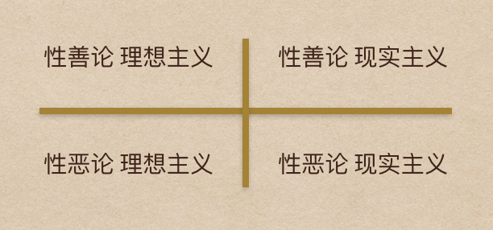

# 1.理解大势

宏观世界太过抽象，但也有理解的抓手。本模块带你理解国际政治、历史、钱、人性和人生决策，让你搞懂最有用的八成。

## 01 ｜趋势：世界是否在降维

这一讲我们讨论的是，世界正在降维。

刘慈欣在《三体》里面写道：失去人性，失去很多；失去兽性，失去一切。理解这句话，你需要先理解现实主义和理想主义的区别。

简单来说，理想主义认为基于规则、共识的合作带来安全，而现实主义则认为，只能靠自己。刘慈欣这句话代表了现实主义者对现实的理解，而理想主义者会这样反击：只有兽性的话，才会失去一切。

我先讲现实主义，讲其中最容易理解的一种版本：世界的真相是英国大思想家霍布斯说的丛林社会，没有法律，没有规则，没有共识，没有信任，只有一切人对一切人的战争。什么都是假的，只有生存、利益和权力是真的，而三者是一回事。

理想主义则是对现实主义的超越：我们不必是丛林社会。一切人对一切人的战争只能走向共同毁灭，我们应该也可以跳出陷阱。在信任、共识、规则的基础上共存，兼容利益。

总之，现实主义认为现实是血淋淋的，理想主义认为不是非得这样。现实主义认为理想主义迂腐，选择理想主义等于坐视被别人毁灭。理想主义认为现实主义危险，选择现实主义终将导致共同毁灭。

### 现实主义的国际政治

第一次世界大战结束 100 周年刚刚过去。一战是西方世界分水岭，二战从内在动力和斗争逻辑看是一战的延续。战争使当时的世界中心变成焦土，一代精英死于战场。国家崩溃，人才凋零，心气沉沦。痛定思痛，精英们反省为什么共同选择了自我毁灭。

战前几百年间，国家之间的基本框架是现实主义的：

- 各国是民族国家，主权神圣；
- 国家之间竞争权力，基本策略是力量平衡（balance of power），就是合纵连横，如果哪个国家过于强大要称霸，其他国家会结盟制衡它；
- 结盟完全是机会主义的，一丝一毫也不永恒，基于力量格局而定；
- 如果某个盟友脱颖而出想称霸，以前的盟友就会变成它的敌人，不惜与此前的对手结盟。

总之，枪打出头鸟，盟友天天变。德国首相俾斯麦也说：搞政治不是下象棋。下棋有规则，马走日，象走田，有些下法不能下，有些位置去不了，搞政治则百无禁忌，哪里都能去，什么都能做。

现实主义力量平衡贯穿了整个欧洲近代史，管用了几百年，但它终究是不稳定的，对政治家们随机应变能力要求过高。它最终于上世纪初崩溃，大战爆发，世界重新洗牌。

新一代精英反思后，选择建立超国家的多边机构，依据共同遵守的法律、规则、共识行事，共同防止战争。这就是今天世界体系的由来：联合国、世界银行、国际货币基金组织、WTO，在新霸主美国的主持下建立。

从全世界的角度看，从来没有像 1945 年到 2017 年间这样理想主义。当然你非要说它虚伪也可以，因为理想主义绝不可能彻底，国家间政治到现在一样是现实主义为本，最多是现实主义理想主义交织在一起。但是，有点理想主义的成分，总比全都跟你搞现实主义好点吧。

现实主义者对这套当然还是嗤之以鼻。即使这套体系是美国牵头建的，在美国也始终有一派很强的力量主张抛开国际体系单干。他们觉得这要么不管用，要么限制了美国的行动自由，要么让美国承担了过高成本。

世界的真相一点都没有变：国家之间处于无政府状态，没有超国家机构提供安全保护；每个国家都拥有武力，相当多的国家有核武器，也都无法对其他国家完全放心，为了生存，所有国家都要追求力量，保证安全。

### 进攻性现实主义

当代现实主义政治学代表人物之一、芝加哥大学政治学教授约翰·米尔斯海默（John Mearsheimer）把这套逻辑外推到极致。

第一个外推：

国家对力量的追逐不会满足于进入大国之林而已，而是要到获得霸主地位为止。所谓霸主，就是比所有其他国家及其联盟都更强大，以一国敌天下，因为只有这样才足够安全。

更重要的是第二个外推：

国家间竞争的不是绝对力量而是力量对比变化，如果我变强但你也变强，导致我的相对优势减少，那么我的安全就受损了。由此，米尔斯海默把国家间的安全考虑博弈变成了简单残酷的零和游戏。如果我领先，那么差距绝不能缩小；如果你领先，那么差距绝不能扩大。

讲个故事你就明白了。有人捡到一盏神灯，灯神跟他说，现在你可以许下任何愿望，我都能帮你实现。另外我今天心情特别好，所以凡是你认识的人，我今天给你的，我都加倍给他们。这人想了想，捡起一根树枝递给灯神说，“把我一只眼睛戳瞎吧。”

这套做法，米尔斯海默称之为“进攻性现实主义”(offensive realism)。在他看来，这场零和游戏与国家性质无关，与民族性格无关，也无关乎正义邪恶。美国两次参加世界大战，不是为了打败纳粹，而是为了防止欧洲出现新霸主；冷战不是为了保卫自由，而是必须打败霸权竞争者苏联。自由贸易、多边机构也化解不了国家间冲突。

### 国际政治的三个时代

米尔斯海默的进攻性现实主义理论对不对？

我想说它不对。 **人类社会的发展，就是不同层级群体逐渐接受法律、规则、共识的过程，从个体之间开始，经由家庭、宗族、村落、部落、国家，步步上升。在越来越大的规模上，我们超越丛林社会，建立秩序、规则和稳定。**

今天，秩序、规则和稳定已存在于国家之内，国家之间则还处于无政府状态，为限制这种无政府状态所打的种种补丁，从联合国到 WTO 到欧盟，是理想主义在现实世界中取得的成就。

另一种来自政治学者，同样基于冷静算计的批评，我推荐中国政治学者、复旦大学教授唐世平。他在《国际政治的社会演化》以进化论来解国际关系史，认为经历了三个时代。

首先是进攻性现实主义时代，国家间以力量相互吞并，要么征服要么被征服，这埋下了自我颠覆的种子。征服使国家数量越来越少，而规模越大，此前的征服越有效，接下来就越失效。

从现代民族国家体系建立以来，所有建立全球霸权的努力都没有成功，这将世界带入防守性现实主义时代，大国消灭不了对方，不得不寻找共存之道。

最后，二战结束以来，终于接受长期和平共处现实的大国们，趋向长期合作，并催生多边规则，走向基于规则的国际关系。

用大白话来说：第一，谁也消灭不了谁，那就好好过吧。第二，既然要好好过，那就讲道理吧。

唐世平认为，进攻性现实主义适用于前大国政治时代，防守性现实主义适用于大国政治时代（17 世纪中叶至二战结束），基于多边规则的国际关系适用于二战结束以来的时代。要是将理论与时代错配，后果很严重。从唐世平的框架看过去，米尔斯海默在今天讲进攻性现实主义无疑是返祖现象。

### 零和博弈让世界降维

但是，我也不能说米尔斯海默就错了。

人是观念的动物。人们被自己相信的东西所驱使，世界观里只有零和游戏的人看什么都是零和游戏，也会行动起来把一切真的变成零和游戏。

刘慈欣在《三体》里讲到降维，高等级的文明用一根二向箔，就把太阳系从三维世界降成二维，席卷，推平。他写的是科幻，现实中的人类合作秩序有多重维度，但零和思维就像二向箔，能将正和思维推平降维的实力——只要对方是零和思维，你就只好也变成零和思维。

米尔斯海默的进攻性现实主义理论形成于冷战结束之后，过去几十年间，一直与世界政经形势格格不入，在理论界处于边缘。但今天大不同，仔细看特朗普政府各种做法，如果说是由进攻性现实主义世界观驱动的，看着像是，听着像是，做着也像是，那它就是。

国家间从来是实力政治为本，在我们可以看到的未来可能会更赤裸裸。一位基辛格年代就参与对华建交的美国外交老人告诉我，“大家都在离开现在的国际体系大厦”。也许十年之后，国际体系运行逻辑会回到一百年前，联合国-世界银行-WTO 这些大厦只剩下空壳。

想这么大干什么？这跟你我有什么关系？

在这新图景中，国家的对外对内的行动空间更大，至于大到有多大，只取决于它的实力。不论你做什么工作，对未来有何计划，此刻都要意识到它变动的方向。而个人选择有限。“如果你是世界公民，那么你哪里的公民也不是”， 英国首相特蕾莎·梅这句话已经成为时代预言。

降维是我们这个时代面临的最大风险。接下来的航程连维度都不明朗，大家珍重。

### 本讲小结

总结一下，要理解今天的世界正在发生什么变化，你需要先理解现实主义和理想主义。理想主义认为基于规则共识的合作带来安全，现实主义则认为只能靠自己，最极端的进攻性现实主义更认为安全是零和博弈。

国际政治从最开始的进攻性现实主义阶段，演化到大国之间的防守性现实主义阶段，再演化到二战后基于规则的国际关系。当下的最大危险是可能出现返祖现象，进攻性现实主义重回舞台，使世界面临降维风险。

这一讲内容受中国学者唐世平的《国际政治的社会演化》的启发。该书的英文版获得了 2015 年度国际研究协会年度最佳著作奖，唐世平是第一位获此荣誉的中国学者。

另外，关于米尔斯海默的思想，在我另一个课程《30 天认知训练营·2018》里展开讲过——《用博弈论读懂中美关系》

### 思考题

最后我给你留一个思考题：

你是倾向于理想主义，还是现实主义？为什么？

## 02 ｜过往：为何总是重蹈覆辙

这一讲我想跟你讨论的是，历史到底有什么用？

你先听三句话：

> 在分析中，一切知识都是历史(All knowledge is, in final analysis, history)。
>
> 经抽象后，一切科学都是数学(All sciences are, in the abstmct, mathematics)。
>
> 从依据看，一切判断都是统计(All judgements are, in their rationale, statistics)。

大统计学家拉奥（C. Radhakrishna Rao）在名著《统计与真理》的扉页上写下这三句话，振聋发聩，气势非凡，但没留下解释。好在你记住多读历史，把数学和统计学好，就行，显然这三门学科搞定一切。

### 历史存在于整体之中

跟你讲讲我对这三句话的理解：

我们所处的是现实世界，但可能世界则有无穷多个。正如我将要写的下一个字有一百种选择，但我只能选一种，这个字就塑造了现实世界，其余则变成九十九个没有变现的可能世界。世界上发生无穷多件事，每件事有无穷多种可能，其全集就是所有可能世界。

站在现实世界和可能世界之间回看拉奥的三句话：数学界定了可能世界的空间，只要数学能够想象的，它就是可能的；从无穷多的可能世界收敛到这一个现实世界，哪怕我选定一个字这件小事，是统计管的；最后，所有知识都是关于现实世界的记录，所以是历史。

思想总在顶层汇通。统计学家拉奥的看法跟历史学家马克·布洛赫（Marc Bloch）的看法一模一样： **历史存在于整体之中**。

布洛赫是法国年鉴学派大师、总体史观的开创者之一。他认为，历史当然不是研究现在，但也不是只研究过去，而是研究时间中的人。时间是从过去到现在的整体，只强调现在或过去都没有意义，理解过去才能理解现在，理解现在才能理解过去。一个人说过的话、写过的字、创造的事物、触摸过的一切，都传达了关于他的信息。

历史应当用一切可用的方法去研究一切，材料不限于历史文献，对象也不限于政治、军事、外交，经济、地理、社会乃至人类学都在射程之内。历史学家要穷尽可能，必须掌握这个行业所有重要工具，哪怕只是理解这些工具能用来做什么，操作困难何在，限度又在哪里。

他把这些写进了名著《历史学家的技艺》（The Historian’s Craft），年鉴学派总体史观的宣言书。

### 历史有什么用

历史有什么用？年幼的儿子曾经问过布洛赫。

布洛赫的学术生涯是在 20 世纪上半叶。1939 年，二战爆发，53 岁的布洛赫应召参军，然后法国一战即溃，一同崩溃的还有秩序、安全、地位、财产，曾经坚固的全部烟消云散，只剩下两样身份：法国人和历史学家。布洛赫是犹太人，但他没有选择逃亡。他说自己不能想象离开法国，那样就连呼吸都不会自由。

作为法国人，他选择留下来；作为历史学家，他还得做点什么。

历史有什么用？同一个问题由成年人又问了布洛赫一次。德军开进巴黎当天，法军总参谋部的军官们面面相觑。有人问布洛赫，“历史背叛了我们，对吗？”

当社会陷于危机，自我怀疑，就会问这个问题：我们到底从过去学到什么？我们学得到底对不对？

1941 年春天，布洛赫终于有信心给出回答。《历史学家的技艺》是他回答的第一半。布洛赫题记献给同行：

“今天我们共同的志业受到威胁。错不在我们。我们被不公正的命运击垮，仅此而已。相信那一天总会到来，我们的成果将获得自由，公诸天下。”

国破家亡，人在流亡，布洛赫用写作来找解药，讲历史学的方法：历史必须是个整体，所以没有万能的方法，只能是持续的挖掘、比对，保持常识并保持对常识的警醒。

这书平静如常，虽然是由战乱催生，但也是长年思考的结晶。它是历史学家的证词，一位巨匠诚实讲述他这行当的精要。如果不知背景读这本书，还以为他身处平静书斋，其实他在放不下书桌的地方写书。

历史是整体的，过去与现实有活生生的关联，布洛赫的历史学不是说说而已，它有关选择与行动。

本书写作开始于 1941 年，布洛赫 55 岁，东奔西藏，朝不保夕。拿起笔，他是历史学者，为后辈留下技艺；放下笔，他就拿起枪，变成抵抗纳粹的里昂地下组织领袖。在所有可能世界之间，通过行动，布洛赫进入他选择的现实世界，把自己变成了历史的一部分。

布洛赫说，人们都想要理解，通过理解成为历史行程的一员，光是知道远远不够。一门学问必须提供解释，否则就是大杂烩。历史不是陈列柜，它的作用超出学术本身。首先使我们更好地理解，然后指导我们的行动。仅仅满足于描述历史是什么样的，永远是对它的背叛。历史学家必须有强烈的个人意见，这是他们的责任。

五十之年，惟欠一死，经此世变，布洛赫选择战斗。行动是他的另一半回答。

在布洛赫总体史观里，历史与现实融为一体。只有体验现实脉动，才能真切理解历史。你理解历史悲喜剧的现在时，才能洞察它的过去时。如果不体察身边的人、事、时势，那就没有一丝可能性当好历史学家。

1944 年春天，布洛赫被捕。6 月 16 日，盟军己经在诺曼底登陆，他却没有等到胜利，在里昂郊外被纳粹枪决，同时遇难的还有 26 位同袍。《历史学家的技艺》没有完成，他原准备题献给妻子，但妻子已经遇难。

知行合一，布洛赫将总体史观付诸实践：生活是一个总体，是现实与理想扯不断理还乱的纠缠。他没有背叛历史，表达了自己的意见，作出了自己的回答。

### 我们为什么一再重蹈覆辙

布洛赫是答完了，但他把问题留给了我们：

历史有什么用？如果我们一再重蹈覆辙？

诚如布洛赫所言，历史关心的是时间中的人，从过去到现在，不过你我不是历史学家，我们更关心未来。我们希望从历史中获得关于未来的线索。这里有个悖论：

我们之所以希望从历史中学习，是因为我们一再重复过去；但重复过去本来是不应该发生的，越重复则可预见性就越高，我们就越能避免。既然如此，为什么还总是重复？

我能想到三个回答。

第一，历史之所以重复，是因为路径依赖，锁定在轨道上，大家不是不知道会发生灾难，但还是眼睁睁看着火车出轨，所有人都有无力感。物不极不会反（things will not get better before it gets worse），不到最后关头没有可能回头。

第二，绝大多数人从历史中学习，只是从最近一个可比的、相似的重大事件中学习。比如说，2008 年金融危机确实是被反复研究透了，我很有把握地说，下次全球金融危机到来时，绝不会是 2008 年同一种病毒。我们总是能避免最近一次灾难马上重演，它只会在我们对它的记忆不再真切的将来重演。

第三，历史只是无穷多种可能中的一种在现实中展开，掌握合理的反事实思考（counterfactual thinking）能力，才有可能揭开其层层面相。历史中藏着无数可能发生但却没有发生的危机，只因有人预作绸缪，将灾难苗头掐死在萌芽之前，所谓善战者无赫赫之功，历史对这种人不公平，将他沉埋在故纸堆中。这是他的小悲剧，却是我们的大悲剧。

### 本讲小结

总结一下，历史有什么用？总体史学给了我们示范。

第一，理解过去才能理解现在，理解现在才能理解过去；

第二，对历史必须有强烈的个人意见，否则等于是对历史的背叛；

第三，理解之后必然是行动。

今天的内容灵感来源于，年鉴学派大师布洛赫的书《历史学家的技艺》（The Historian’s Craft by Marc Bloch），推荐给你。正如读《史记》你要知道司马迁本人的故事，读《历史学家的技艺》，你要知道布洛赫本人的故事。

### 思考题

最后，我给你留一个思考题：

我今天讲到善战者无赫赫之功，你能不能举出这样的例子？

## 03 ｜财富：钱有什么用

每个人都是关于钱的专家，这一讲我却要冒天下之大不韪，跟你讲讲钱的用处。

钱是最坏的主人，最好的仆人。如果你把钱当作惟一的 KPI，不顾一切拼命刷，结果就是它当家作主，你变成它的奴仆。反过来，如果你把钱当作工具，那它就是最好用的工具。要把这工具细细讲过来，一部教科书都不够，但听我讲 10 分钟也能懂个八成，我希望是正好够用的那八成。

### 钱和信用

狭义的钱，就是社会接受用来作最后结算的那个东西。买了货，接受了服务，最后付钱，大家两清，这事才真正结束；如果给的是支票、信用卡，那这事还没结束，支票和信用卡只是你会付钱的保证，最后对方要拿到钱才算数。

支票、信用卡、信贷、债券、金融证券化产品，等等等等，都是钱的衍生品，它是人们交易时愿意暂时接受的支付方式，但不是最终结算。链条可以很短，现金全款买房，房款两清，结束。链条也可以很长，用贷款买房，你是用未来 20 年还贷款的长期承诺买房，链条变长。

银行又把许许多多房贷打包，这个包有底层资产，就是房子，可测算未来现金流，就是定期还本付息。那这个包就可以就拿出来单卖，房贷就完成了证券化，变成了可流通的债券。再贴上 AAA 信用评级，拿它作抵押再去贷款，在金融体系流动起来，简直跟钱差不多。

与链条对应的是一层层的还款承诺，买房者的还款承诺，银行对房贷债券的还款承诺，金融机构拿它作抵押去贷款的还款承诺，这里讲的是买房生发出来的承诺，其他也相似。全社会的经济活动就是所有这些还款承诺层层叠加在一起而来的。还款承诺就是广义的钱，也叫作信用（credit）。

信用跟信心是一回事。信用是从借钱的人角度说的，信心是从把钱借出去的人角度说的。一个社会的信用扩张还是收缩，取决于双方的信心，也就是信用。钱借出去能不能收回来？政治形势、经济走向、行业前景、企业管理、个人诚信，这些都影响判断。

以美国为例，社会总信用的数量是钱数的 15 倍左右。钱的扩张取决于政府，也就是央行印钱的节奏。信用的扩张，也就是广义钱的扩张，它取决于整个社会中卖方接受买方，将来还钱承诺的意愿。乐观的时候，意愿强，信用扩张；悲观的时候，意愿弱，信用收缩。经济增长必然伴随着信用扩张，信用收缩意味着经济收缩。

信用是信心，政府印的钱其实也要靠信心。当人们对钱本身的信用产生怀疑，就是对政府掌控钱的能力产生怀疑，后果更加严重。

全球早已进入法币时代，法币（fiat money）的意思就是政府垄断了钱，印张纸说它是多少钱它就是多少。可想而知，政府对挑战法币的会有多么敌视。前美联储主席伯南克在国会听证时说过，黄金不是钱了。议员们非常恼火，黄金几千年来都是钱，怎么你们说不是钱就不是了呢？议员恼火归恼火，政府清楚得很，它必须垄断发钞权。

**正因如此，人们必须对钱的信用保持警惕。政府是各种社会利益的聚合体，人性由俭入奢易，由奢入俭难。** 有困难就印钱，难言之隐，一印了之。法币时代，不论哪个国家，不论财政货币政策说起来是扩张还是审慎，货币贬值是常态。就以表现算最不错的美国为例，今天美元的购买力跟几十年前，美元从黄金脱钩时相比，已贬去了 95%，1 美元只剩下 5 美分。

### 五种钱各有什么用

讲清楚钱的概念，我现在讲从狭义到广义，各种钱各有什么用处。

**第一，比特币和黄金。**

刚才说了，美联储不承认黄金是钱，但是人民公认。没有一个政府承认比特币是钱，人民则还远远没有拿定主意，只有很小一撮人这么想。比较稳妥地说吧，这两样是法币的潜在竞争者。

黄金的价值不在于对抗通货膨胀，黄金几十年来的价格变动并不能支持这个想法。黄金的价值在于不管各国政府怎么说，全人类对黄金有根深蒂固的信念，毕竟一百年的洗脑还是很难对抗一万年的共同经历。当人们对法币丧失信心，就一定会想起黄金。

黄金也不是用来对抗经济周期的。当人们对所有法币都丧失信心时，经济多半已沉苛难起，政治上也多灾多难。黄金的价值是人们为未来准备的灾难预案。美联储再硬着头皮说黄金不是钱了，它不也得储备黄金？

透过黄金的棱镜看比特币，就明白比特币的未来大概会落在哪个区间了。

它的降生就是为了挑战政府垄断的发钞权，必然遭受全世界政府的联合围剿，但它也很幸运，等到政府醒过神来的时候，它已经一路狂奔越过了生死临界点。它已经有足够大的生存空间，再不会死了。它的下限是不会死，上限是不会替代法币。

它不像黄金一样有人类上万年的记忆护体，最终它只会对一小撮人来说成为类似黄金的东西，是这一小撮人为未来准备的灾难预案。只不过，在它准备的灾难图景里，世界上至少还有互联网和电；黄金这两样都不需要。

**第二，外汇。**

这有两层。

第一层是现代人的资产组合里本来就有一部分应该是国际资产。经济早已全球化，而绝大多数人，生于斯长于斯，工作于斯，收入来自于斯，过度集中于本地。 本来就应该适度投资于国际资产，作多元化组合，享受现代金融理论提供的免费午餐：在相同收益率下减小风险。不这样做，等于把免费午餐留在桌子上，中国人把太多的免费午餐留在桌子上了。这是第一层。

第二层是法币对应着对政府的信心，不同法币之间的升降折射对各国政府信心的升降。要是在适度多元化基础上继续超配外国货币定价的资产，本质上是对其他政府投信任票，没有哪个本国政府是开心的。

**第三，现金。**

现金是常态下的终极支付手段。如果社会信用扩张，人们创造并接受越来越多的信用作支付手段，就会逃离现金，因为现金没有回报这一点特别招人恨。反过来，如果社会信用收缩，层层抽紧，从衍生品逐步收缩到贷款，贷款又进一步抽走，都不再接受信用作支付手段，那现金就身价倍增。

这就是为什么巴菲特把现金视作对任意资产的无期限的免费期权。近一二十年来他做了很多这种生意：信用扩张时他攒现金，信用收缩时他把现金放出去，你既可以说他是低买高卖资产，更可以说他是低买高卖现金。

其实，免费期权只是名义上的，现金有其成本，机会成本是其一，更永恒的是通胀成本。现金的购买力恒时在缩水。如果正常状态终结，超级通胀到来，现金会给持有人带来毁灭性冲击，那时社会重新洗牌，货币推倒重来。

**第四，股票和债券。**

持有股票本质上是持有看多期权，收益上不封顶，亏损最大就是买入时的出价；相反，持有债券接近于卖出看多期权，获得固定利息，对应承受本金损失风险。

许多人认为股票比债券风险大，这看法在理论上是合理的，在实践中你可真不能依赖它。近年来无论多复杂的固定收益产品都能直接卖给普通人，就因为顶了个固定收益产品的名头，假装风险能小一点，其实是幻觉。今天各种所谓固定收益产品，越来越衍生，越来越复杂，普通人越来越看不懂。

还有一点，股票交易价格是连续的，价格变动反映了投资者对风险收益的实时判断。债券不是这样，绝大多数时候风和日丽，一有事就电闪雷鸣，只有极端状态，没有中间状态。

**第五，最后我讲讲房子。**

房价在长期中能对抗通胀，这是房价的基本面，但房价经常不是由基本面决定的。

我在耶鲁上金融危机课时，听麦催客（Andrew Metrick）教授说， 十次金融危机有九次是房地产惹的祸。为什么呢？因为人们对房地产的信念接近黄金。

《飘》里面，北方军打到南方，郝斯嘉父亲临死之前就给她留了一句话：保住土地，土地是一切。土地这种不动产，是创造信用、扩张信用、衍生信用的最好载体，信用扩张过头了崩掉就是金融危机。

麦催客说的还是成熟经济体。在那些信用体系还未建立，法治社会还需要完善的经济体里，信用扩张可不是更得指望房地产吗？房子创造信用，信用推动房价，这条信用与房地产双螺旋推动下的扩张周期，是一荣俱荣，一损俱损的。全人类都没看到解套的办法。

### 本讲小结

总结一下， 这一讲我给你讲了五种最基本的资产各自对应着什么层次的风险管理。理解这五种资产的用处，运用这些工具，做到跟你想管理的风险不错配，你就已经赢了绝大多数人。

今天的内容灵感来源于一门课《全球金融危机（The Global Financial Crisis）》，这门课是耶鲁大学管理学院明星课程，由安德鲁·麦催客（Andrew Metrick）教授讲授，邀请了金融危机主要处置者之一、时任美国财长盖特纳（Timothy Geithner）主讲。我在耶鲁“世界学人”项目期间完整上过，收益很大，现在他们把这门课放上了 Coursera，我把链接放在下方，推荐你也去学习。

课程网站：[The Global Financial Crisis](https://www.coursera.org/learn/global-financial-crisis)

### 思考题

最后，我给你留一个思考题：我认为比特币不会死，你觉得呢？

## 04 ｜人性：人从什么时候变坏

今天我们探讨的问题是，人性本善还是恶？

### 性善论与性恶论

认为性本善的人认为，以前有个黄金时代，距今大约一万年，男人狩猎，女人采集，群体分工、协作、分享，人人营养平衡，身心健康。那个时代没有战争，没有等级，没有财产当然也就没有穷富差别，也没有传染病。

对那个时代的想象，奠定了一种极有影响力的思维：性本善。最初都是好人，只是后来变坏了。

怎么变坏的呢？

发明了农业。农业意味着定居，意味着阶层，意味着收获，意味着余粮，意味着分配，意味着得武装起来防止别的群体来抢夺余粮。无尽冲突从此开启：阶级分化了，财富产生了，战争到来了。连营养都变差了，绝大多数人忙于在田间劳作，却只能果腹而已。人类从此失去了乐园。

**性本善吸引力强大，因为它指向的解决办法最简单：回到没有被污染的过去，回归人人都有的善良本性，就可以重回黄金时代。** 解决一切现实烦忧，只需要找到并去除那些遮蔽了我们善良本性的坏东西，重获良知良能就行。

与之针锋相对的是性本恶。

奥古斯丁说，婴儿不作恶，只是因为力量太小。人性本恶，通过教化才习得合作。荀子说，人之性恶，其善者伪也。“伪”这个词用得非常深刻，它指美德是后天培育出来的，不是先天内置的。文化也就是礼义教化的功能在于化性起伪，化解恶的本性，造作出后天的美德。

性善论与性恶论都同意人们现实中是善恶交织的，但对成因和解决之道看法不同。性善论主张去除后天污染，回到原初；性恶论则研究恶人们是怎样结出善果的，也就是说，为什么会合作？合作为什么时常瓦解？怎样才能最大限度使合作延续下去？

### 人性的四个象限

性善论与性恶论对峙，贯穿了人类迄今的全部道德哲学史，也一定会延续到将来。它与另一对冤家，理想主义和现实主义两两组合，可以搞出下面这个四象限：

**性善论理想主义**认为应该而且能够回到起初那个干干净净的初始状态，不管是上古黄金时代还是初心。

**性善论现实主义**认为应该回到起初，可惜已经晚了，回不去了。

**性恶论理想主义**认为从来就没有过什么干干净净的初始状态，但人类合作秩序能够变得更强健，扩展到更广阔的天地。

**性恶论现实主义**认为人类合作秩序产生本身就是个偶然奇迹，非常脆弱，难以持续，随时堕入三恶道。

我在朋友圈作了个简单调查，一看结果，朋友们基本上分布在性恶论的两个象限里。这倒不意外。我自己是站在性恶论理想主义那里的，人以群分，朋友圈是同质的。

**四象限本身没有好坏，它们只是各自对应一种看法，行为则是另一回事。**

比如说，无论我的朋友们是性恶论理想主义还是性恶论现实主义，面对合作秩序，他们仍然都有选择的自由：既可以加入合作，促使其更加强健，帮助其进一步扩展；也可以选择别人合作你套利，因为要是合作秩序能够继续扩展的话，套利对套利者是有利的，要是合作秩序瓦解的话，套利对套利者仍然是有利的。

一个人可以是性善论理想主义者，但是选择作恶；一个人也可以是性恶论现实主义者，但是选择行善。

### 人性的善是后天习得的

如果就看法说看法，我是不同意性善论的。孟子说人皆有恻隐之心，推广开去即为良知。我承认人皆有良知，但让我们回到身边最接近起点的那个地方，看看身边的婴儿，谁曾在婴儿那里看到过良心？

作为两个小朋友的父亲，我亲眼观察亲身经历他们的成长。不管后来成长成什么样子，小朋友的起点是一样的：极为现实，毫不天真，绝无同情心，很少同理心。同情心和天真，如果你在小朋友身上看到这些东西，那不过是看到了你自己投射在他们身上的幻觉而已。小朋友长大成人才能获得这些品质。真正的天真从来只在成人那里出现。

看看跟人基因最接近的黑猩猩。BBC 史诗级纪录片《王朝》（Dynasties）开篇就是黑猩猩森严残酷的等级社会，黑猩猩为了爬到等级之巅独占繁衍特权，为了继续呆在那里，那是文斗武斗什么都干得出来。凭什么黑猩猩下了树站起来之后，突然人类就有了个田园牧歌的早期黄金时代呢？

回到起点，回到过去，回到最初，真回去了到底是黄金时代还是黑猩猩社会？

《高贵的野蛮人》（Noble Savages）这本书里有答案。

### 原始社会的田园调查

作者沙里翁（Napoleon A. Chagnon）是美国文化人类学家、专注研究亚诺玛米人（Yanomamö）50 年。亚诺玛米人生活在亚马逊河流域最深处，两万多人，200 多个村落。在 20 世纪中叶时，他们是全球仅存的没有与外部接触过的原始人群。

沙里翁 1964 年来到这里，一辈子观察研究，是这群原始部落在“未经污染”状态下内部政治、社会、军事冲突最早也是最后的目击者。他到达亚马逊密林深处，好似穿越回人类社会的起点，带回来一个结论：

对亚诺玛米人来说，生活就是持续不断的战争，核心是为了争夺女性及繁衍权。暴力围绕争夺繁衍权展开，社会围绕使用暴力来组织，衍生出一套完整的权力结构、声誉机制和战争谋略。

关于起因：村庄之间战争的首要原因是抢夺女性。亚诺玛米人当中，约 20%成年女性是抢来的。男性对不论村庄内外的女性都有极度的占有欲和攻击性。跟争夺女性相比，对于物质资源的抢夺很次要。

关于暴力：45%的成年男子杀过人，40 岁以上的人口中，2/3 有至少一位近亲死于暴力。杀人者平均下来繁衍的后代也更多。

关于权力：村庄之间的权力大小取决于人数多少，获得女性的能力直接与男性人数挂钩。决定村庄规模的三大因素是血源、婚姻和头人的能力。

关于头人：头人有三个非正式权力的来源：父系亲属的数量——这对应着其祖爷的繁衍成功率——以及杀过多少个人，这两个是硬指标。还有一个是政治才能，就是他审时度势，不多说话，但凡说话只说那些他预期会被遵守的命令。为什么呢？因为只要命令被人拒绝，就是声誉受损，只能用流血来解决。

关于声誉：对所有男性来说，有辱必流血，有流血必报仇，不然则是懦夫，而懦夫只会招惹更多欺辱；人数越少的村子，男人必须越显得好战，博得残暴声誉，以弥补人数劣势。

亚诺玛米村落之间时常举办鸿门宴，这是大规模屠杀的专用安排。主谋方往往要借助假装中立的第三方帮助，由其出面举办宴席，邀请目标村庄全村参加。主谋方则藏身一旁，等待摔杯为号。鸿门宴的先例很多，每个村庄接受另外村庄宴请，都必须极为谨慎。

沙里翁问一场鸿门宴的主谋方和赴宴方，为什么明知是鸿门宴还要赴宴？为什么明知对方已经知道是鸿门宴还要邀请？ **双方回答相同：有宴不赴即是懦夫，而在亚诺玛米社会里，背着懦夫名声比赴鸿门宴更危险。所以，接到邀请的一方把妻儿藏到丛林里，集体赴会，大杀一场。**

亚诺玛米人的战法和谋略都已经很成熟。战前有合纵连横的外交手法，突袭后有交叉掩护的撤退战术，盟友敌人随时转换身份，现代的所谓力量平衡策略，亚诺玛米人随手拈来。他们的马基雅维利程度与现代人没有多大差别。

沙里翁得出结论：

第一，狩猎采集时代没有田园牧歌，而是无尽战争，战争起源于争夺繁衍权。危险总是来自邻居。霍布斯是对的，卢梭是错的。

第二，推动社会演化的首要动力是安全需求。

第三，亚诺玛米人向我们揭示了上古人群的本来面目：血缘很近，规模很小，越小内部才能越和平相处，稍大一点就要分裂，对外则是永恒战争，两者合力下，基于血缘关系的小村庄是保障基本安全的最小单位。

推论是：大规模社会的政治、法律制度等上层构建使人们相互合作，并持续扩展合作秩序，并不是自然而然出现的。当他们难以为继的时候，社会有可能发生塌陷。塌陷的尽头是什么，亚玛诺米人的状态可不是黄金时代。

沙里翁的发现巅覆了那个时代的文化人类学主流，后者认为战争是文化现象，因为争夺物质资源而起。沙里翁则提供了进化论解释：

暴力不是起源于理性争夺，而是本性使然。

他因此成为 20 世纪最有争议的人类学家，在发表第一篇论文之后就被逐出师门，即使到近年，当他被邀请加入美国国家科学院时，还有人辞去院士以表抗议。

其实何必。

不论你在前面的四象限里处于什么位置，只有了解自然状态下的人真正是什么样的，才懂得化性起伪这件事有多么重要，才理解一层层的社会构造如果解体，我们可能会回归到什么极限状态，才明白维护合作秩序及其扩展这件事有多么难，而维持它又是多么重要。

人之异于禽兽，即在于此。

本讲小结

总结一下，人类学家向我们展示了人在纯净的原始状态下是什么样子。我们面临的问题回到过去是解决不了的，只能往前走。人之异于禽兽者几希，但就这一点点是最贵的。

这一讲的灵感来源于一本英文书《高贵的野蛮人》（Noble Savages: My Life Among Two Dangerous Tribes），作者拿破仑·沙里翁（Napoleon A. Chagnon）在原始部落中做田野调查，获得了人类社会初始状态的一线情报。

思考题

我给你留一个思考题：

在今天讲到的四象限中，也就是性善论理想主义、性恶论理想主义、性善论现实主义和性恶论现实主义，你在什么位置？为什么？

## 05 ｜选择：沉住气还是孤注一掷

今天我讲什么时候应该孤注一掷，什么时候可以耐心沉着。

我们先来设想这样一个问题，微信创始人张小龙是业余高尔夫球手中的职业水平，拿了顶级职业-业余配对赛的最高荣誉。假如你有机会跟张小龙打球，假如你居然还想赢，用什么办法机会最大？

别打满全场，就打一个洞，搞不好你一杆进洞了呢。要是选择打满全场，就算你运从天降，有次一杆进洞，全场下来你还是会输——水平差距太大。

如果你进拉斯维加斯赌场，本来是当作花钱买娱乐，下注买个乐呵。赌场对赌客的概率优势，明明白白地写在执照里，你下场的预期收益是负的。

但如果你走投无路，非得靠赌来解决问题改变命运，那么至少你不要分次下注，那只会稳定地逐渐输光。你应该全部押上，一次下注，接受命运的裁决，多半还是一次就输光，但好歹不是必然输光，总算有一点点机会。

赌场喜欢豪客，那是相对而言。假如盖茨去赌场，就要只赌一把，输家赔光，赢家全拿，这样的豪客赌场不敢接。

体育比赛，一方领先了往往打成功率，增加控球，减少进攻次数，以期提升每次进攻得分的概率。如果是面对实力更强的对手，这选择挺合理；但如果自己的实力强过对手，这选择就欠考虑。

强队一方领先，应当保持进攻频率，双方攻守的次数越多，才对自己有利的实力对比才越发挥出来。你进攻次数多，虽然对方也多，但来回越多概率对你越有利。如果你想稳，减少进攻次数，虽然也减少了对方的进攻次数，但对方跟你孤注一掷，经常就是这样翻盘。

概率越是稳稳地不站在你这一边，越要孤注一掷赌运气。相反，如果你是张小龙，如果你是拉斯维加斯赌场，如果你是西班牙足球队，那就没有什么好急的，沉住气，慢慢来，靠概率和水平就行的事，别赌运气。

### 第一层：从实力出发的选择

有人着眼长期，有人选择短期行为，各人各不同，可不光是因为素质、教养、格调差别，有着强大的理性依据：

**对那些有资源、水平、优势的人来说，他们当然该着眼长期，因为着眼长期对他们有利；对那些没有资源、水平、优势的人来说，长期必败，不如短线一搏更好。这是第一层。**

延伸开去说，中国股市短期炒作的多，长期投资的少，固然有多重原因，解决办法也没有可以一招制敌的，但至少不用做一件缘木求鱼的事，就是教育投资者。投资者不需要教育，他们比想教育他们的人更知道真相，至少不装傻。他们本能地知道，在信息不对称监管不给力的市场上，长赌必输。

当然，他们作为一个整体，短炒一样必输，毕竟大数定律放在那里。但至少对他们中的每个人来说，短炒赌运气机会还大一点。吴敬琏先生多年前说过中国股市像赌场，其实吴先生还是客气了，合法赌场占你多大便宜至少还是明牌。

有人不明白中国股市为什么总是熊市长牛市短，把 20 多年走势图拉开来看，总是脉冲式暴涨之后漫漫阴跌，一而再，再而三。其实没什么不好理解的：好不容易赌对一次，你不拿钱走人吗？

### 第二层：受制于环境的选择

这里正好讲到第二层：如果选择短期行为的人太多，那么那些有资源、水平、优势的人也无法继续保持沉着、着眼长期。

市场上完蛋的可不只是散户，金融危机来临时华尔街上所有机构都危如累卵。他们有信息、技术、专业、关系的优势，为什么不沉住气慢慢玩？何必要跟大家一样拼命作次贷衍生品直到撑得要爆炸？

因为做这生意一直赚大钱，不做这生意，你的下一季度报表就没有竞争对手的好看。做这生意，长期中公司也许会完蛋，但不做这生意，马上你自己就完蛋。 **“我们都知道舞会迟早结束，但只要音乐不停，我们就得跳。”当时华尔街最大机构的负责人老老实实地说。**

这不仅是大人物的事。我们来谈谈你吧。

假如你很有能力，身处什么样的组织对你有利？

所谓路遥知马力，你要选那些足够路遥的组织，假以时日， 职业生涯自然步步高升，因为能力站在你这边。

假如你所在组织的金字塔结构比较陡峭，升迁的职位比较少，而组织决定升迁的标准是近期业绩，那么，哪怕同事们能力不如你，只要他们都采取孤注一掷的策略，各自全力投入去干一件大事，赢了就上位，输了就丢饭碗。他们冒的风险很大，对他们不一定好，但你的能力优势就被他们的拼搏给抵销掉了。固然他们当中绝大多数都会失败，但只要有一个人成功，主管位置就是他的了。

你怎么办？你也只能去冒险，哪怕本来你只凭才华就可以。选择冒险，那就要看运气，而运气会拉平你和同事们的能力差距。

所以，那些公认且自认能力强的人，往往去了稳定的大公司，而创业者一般原本处在主流边缘；班上成绩最好的同学，往往过了相对平淡的一生。这些不是命运无常，而是每个人的理性选择，你也可以不这样选，但社会替大家作适应性选择，使这些变成了人生常态。

### 第三层：未来不确定下的选择

现在讲第三层。

这个世界看起来正处在一个大变化的早期。全球化退潮，共识耗散，分歧极化，经济承压，社会撕裂，处处都如此。我们已经熟悉的状态形成于两重合力：1978 年以来内部改革带来长期增长，1991 年冷战结束以来的大缓和带来全球化的突进。今天两重合力都在改变，焦虑四处漫延。关于未来惟一可靠的预测就是它变得难以预测。

我要讲的第三层就是，此时此刻，不必太过悲观。

如果未来变得更动荡，你反而更有条件沉着一点，好比赌场把老虎机全部撤下，换成了 21 点牌桌，概率从稳定对你不利的状态切换到了不稳定状态，大多数时候还是对你不利，但不时出现机会降临。这时，凭借技巧、算力，一点运气，再加上等待机会出现的耐心，你就有机会战胜赌场。

### 本讲小结

总结一下，这一讲我们讲了三层。

- 第一层：当概率越稳定地不在你这一边时，你越要孤注一掷。
- 第二层：当大家都孤注一掷时，你也只好孤注一掷，你的才能就被运气拉平了；而如果你不愿意孤注一掷，那就得站起来走出去，寻找到一个不需要孤注一掷的环境。
- 第三层：当概率变得不稳定时，你反而不必着急出牌，因为真有机会了。当时势转移，未来难测，你不妨更沉着。

这一讲的灵感来源于詹姆斯•G•马奇（James March）的书《决策是如何产生的》（Primer on Decision Making） 。

### 思考题

我给你留一个思考题：

今天讲的比较好理解，但实际上大多数人实际做法正好相反，往往是概率对自己有利的时候孤注一掷，比如说，觉得一门生意十拿九稳，于是押上全部身家。根据今天讲的内容，这样做错在哪里？
