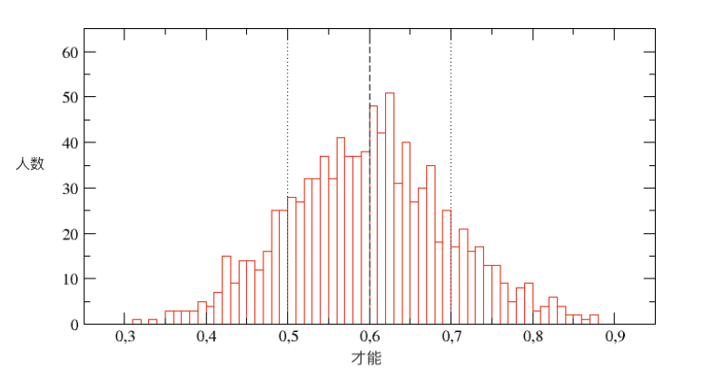

# 2.认知社会

在当下社会，你可能已经输在起跑线上了。但弄明白社会的本来面貌，至少能在后半程让你不输。不输就是赢。

## 06 ｜规划：你已经输在起跑线

这一讲我要告诉你一个坏消息，你输在起跑线上了。

从头慢慢讲。

### 现代社会的两种养老机制

现代人晚熟，20 岁成人，工作 40 年，60 岁退休，80 岁离世。平均而言，大体如此。每个人说到底是自己养活自己，工作 40 年的收入，管生活 80 岁的开支。

实际上是通过代际扶持实现的：前 20 年我们靠父母养育，后 20 年我们靠子女扶助，父母和子女靠他们的父母和子女，反复叠代，这就是代代相传的本义。家庭首先是个经济组织，解决收入与支出的期限错配难题。

今天成熟社会又多了一重安排，就是社保，政府安排下的养老保障。各国社保做法不同，但逻辑都一样。社保的钱不是政府变戏法变出来的，也不是从天上掉下来的，还是每个人自己工作所得，只是换了个解决期限错配的形式：你工作有收入就向政府交社保，60 岁退休就从政府领社保。政府居中，向今天的你收钱，将来再把钱给你。

家庭解决跨期安排，政府也做，虽然表面上是政府将来给你发社保，但你本质还是自助养老，你自己为自己的养老负责，社保只是强迫你在挣钱多的时候储蓄，以维持退休后的生活水平最低不低于温饱线。

政府怕你年轻时把钱花光了，所以把钱先拿走，替你管着，将来再还给你。

等等！这不是家长把小朋友压岁钱拿走时说的话吗？我们现在是成人了啊，怎么还这样？！

政府这么干的目的，就是拿走你的钱去补助穷人。政府搞社保，除了年轻养年老这一层因素，还有转移支付的另一层因素，让收入多的养收入少的。有人交得多，有人交得少，领得却都差不多，结果就是多交的补贴了少交的。

如果你交得多，可能会认为不公平，但政府这么做没什么错。人之道，损不足以奉有余，政府就得替天行道，损有余以补不足。社保的保障水平也就是保到温饱底线，不会让领社保过上富裕生活。假如没有社保，社会差距太大，温饱线下的人太多且无助，那后果你也不想看到。

各国社保不同，有些国家是强制储蓄的含义多一些，体现为强调社保的个人账户。个人账户是你的，将来你领到多少跟你自己放进去多少的相关度高。有些国家是转移支付的含义多一些，体现为重视统收统支，你交的钱进入大池子，将来从大池子领钱，池子是大家的。中国现行社保是两块都有，而统收统支重要得多。

### 为什么我们这一代输在起跑线

好了，现在道理讲明白了，终于可以回到重点了：你输在起跑线上了，在养老这件事情上。

为什么这样说呢？

第一，目测你会是社保交得多的那个群体。社保缴费大半进入统收统支账户，大家交得差不少，领得差不多。你大概率会交得多。不信，看看你的学历、能力、学习力，在社会分布的哪一层？

第二，哪个成熟国家都一样，现行社保持续下去的压力很大。就像先前说的那样，它本质上是每个人用年轻时的收入负担年老时的开支，但是，表现为年轻人养老人后，它跟庞氏游戏就有个相似之处：如果下家人数增加，则越做越好做；如果下家人数稳定，则越做越难做；如果下家人数减少，则马上出大问题。

无论是哪个经济体，你总是想经济增长比不增长好吧？但经济一增长，生活水平提高，而生育意愿必然下降。在人口那一端，表现为人口增长速度下滑，极端的时候负增长，比如日本；这一端则是生活成本上升，社保要保障温饱的成本也越来越高。

两头挤压，社保真是很难。

所以，看到各种关于延迟退休的讨论，你要知道讨论的实质不是什么 60 岁能不能不用再上班。相信我，等你到了 60 岁，你会哭着喊着想上班。没有人想在 60 岁就退下来，切断和身份、地位匹配的社会关系。

而讨论的实质是，社保交费和领取的时间长度要发生变化。假如说，按现在的退休年龄，你是交 40 年社保，领 20 年；如果延迟到 65 岁，你就是交 45 年社保，领 15 年。多交 5 年，少领 5 年，一出一入差 10 年钱，本质在这里。

所以，你也别有幻想，延迟退休这件事是肯定要发生的，早晚而已。社保大池子要是进水和出水不平衡了，要么减少出水也就是社保领取少了，要么增加进水也就是社保交费高了。社保大账是一定要做平的，而增加交费总比减少领取要容易做，容易做的事就一定会优先做。

第三，这是对你最最最重要的，你和我这一代人处在历史的转折点上：我们是既扶养老人又养育子女，但等我们自己年老后指望不上子女扶养的第一代中国人。代际扶持模式正在发生历史性变革，谁也无力改变，个人只是螳臂挡车。

变革之前，社会通过代际扶持是平衡的：20 岁前父母养，60 岁后子女养；变革之后，社会也是平衡的，20 岁前父母养，养子女到 20 岁。 **只是在前一个平衡转换到后一个平衡的中间，有一代人要付出代价，就是我们这一代。**

### 你怎么提前规划

后果很严重。

前面讲过，正常是工作 40 年的收入管活 80 年的开支，到我们这一代人，变成了工作 40 年管 100 年的开支，多出来的 20 年是养子女到 20 岁，但我们这一代指望不上下一代来养我们了。如果你是独生子女的话，同情你，另外再加 20 年开支。

你还年轻，养老离你还很远。这就是那种重要但不紧急的事，它容易被忽略，生活中不重要但紧急的事毕竟太多。 **但养老确实是件年轻时就得有数的事，等你老了就晚了。它是真正需要做的人生规划。**

你的人生规划至少得包括下面三点：

**第一，必须储蓄，储蓄必须用来投资，而投资期是一生。**

当你明白投资期如此之长后，就知道某一类资产的一时涨跌不重要，重要的是在数十年的跨度中你得始终有合理的资产配置。

**第二，长期投资收益率必须战胜通胀。**

这很直观，养老等于延期消费，你把现在的收入留到将来消费，假如输给通胀的话，未来的消费水平就得下降。对于上一代或者下一代人来说，长期投资打平通胀就够了。对于我们这一代人来说，光打平通胀还不够，还得补足多出来的 20 年开支。简单折算，你的长期投资收益得达到通胀的 1.5 倍。

打平通胀不难，合理多元化的指数化投资组合，多半能做到。但战胜通胀 50%就没有既通用又靠谱又容易的做法。至于独生子女，那得战胜通胀一倍才行，是有人做得到，但整体不可能做得到。再说一遍，我们这一代已经输在起跑线上了。

**第三，输在起跑线上的，只能在终点拿回来。**

要补回那 20 年多出来的开支，最简单的算法就是我们这一代人多干 10 年，少开支 10 年。不管法定退休年龄是多少岁，我们实际得工作到 70 岁，独生子女则要做好干到 80 岁的精神准备。必须工作的生涯这么漫长，我们别无选择，只能是终身保有工作能力，为此只能是努力终身学习。我见过太多出了校门就不再读书停止学习的人，真是为他们感到担心。

至于你我，加油，这不是可选项，这是必选项。

### 本讲小结

总结一下，这一讲我把社保的逻辑讲清楚了，也给你我把账算清楚了。总之，你已经输在起跑线上了，必须作好在终点补回来的准备。而准备得从现在做起，因为终身保有工作能力的前提是终身学习。

推荐你读阿图•葛文德（Atual Gawande）的书《最好的告别》（Being Mortal）。这本书展示了很多你老年可能会面对的处境。

你可以把这一讲发给你的朋友，提醒他们这件虽然不紧急，但很重要的事，从现在做起。

### 思考题

最后，我给你留一个思考题，七十岁还在工作，肯定不能靠体力，那靠的得是什么能力？

## 07 ｜运气：比你想象得还不公平

这一讲，我想给你讲运气，这件看起来捉摸不定的事。

常识告诉你，成功取决于你的智力、努力，还有运势等等，天时、地利、人和缺一不可。常识也告诉你，智力、努力在于自己，而运势不在于自已，所以只能是穷尽人事，然后坦然面对天命。这些都是对的。

但常识没有告诉你，最后站在成功之巅的人，并不是你想象中的那种人。你以为他们用智力碾压你，比你还努力，运气又好到爆。

如果真是那样，倒也无话可说。

但不是。他们的智力不能碾压你，他们不见得比你更努力，他们只是运气好到爆而已。

### “才能对运气”的极简实验

一群意大利物理学家和经济学家组了一个跨界团队，做了个极简实验，就叫作“才能对运气（Talent VS Luck)”。之所以说是极简，是因为他们把成功之道简化成二元方程，成功=才能+运气，其他因素分别划归到这两项下面。

在这个模型里，运气是随机降临的。当然，运气的本义就是随机的，只不过真实生活中，被我们叫作运气的许多东西其实不是随机的，这个一会儿再讲。记住他们这里用的是狭义的运气，实验环境比现实还公平就好。

在模型里，才能的分布是钟形的。什么是钟形分布呢？钟形曲线的顶点在平均值，然后朝两端极值下降。绝大多数人的才能都在接近平均值的两边。2/3 人的才能在距离平均值一个标准差的地方。这不是假设而是事实，现实中，人们的才能就是按钟形分布的。

举例来说，人的平均智商是 100，总共有 2/3 的人在 85 到 115 之间。再往两边走，曲线急剧走平，天才和白痴都很少见。智商超过 145 的一般认为是天才，按照钟形曲线，天才所占的比例略高于千分之一。

你记住这两个数字，普通人占 2/3，天才差不多千分之一。

运气、才能在模型中是这样相互作用的：好运气到来则收入增加，坏运气到来则收入减少。不过，好运气发生在不同才能的人身上效果不同，才能高的人遇到好运，收入增加得多，才能低的人收入增加得少。这也跟现实生活一致：运气来了，你还得有能力抓住，才能高的人运用得更充分，白痴运气再好也没用。

上面讲到的几大要素：运气是随机降临的，才能是钟形分布的，有才能的人从好运中获利比普通人多。这些实验的预设条件，要么比现实情况更公平，要么本身就是事实，要么是合理推断。

剩下的是模型细节，实验设定每个人不论好运气坏运气，每半年遭遇一次运气，那么在职业生涯中与运气遇合 80 次后，哪些“人”会获得成功？

科学家跨界团队拿模型跑了 100 次，100 次的结果可以说完全相同，非常稳定，得出三个结论。

第一，成功的分布不出意料是金字塔形状，完全符合二八定律，20%的人拥有 80%的财富。这个难说公平，但也没什么好办法，只要事关人际之间的互动，无论分配的是什么，最后大多逃不掉这个金字塔。

第二，如果说站到金字塔尖的人都是人杰，那也就罢了，但不是。 站在塔尖上的基本都是普通人，其才能在平均值附近。他们能站在塔尖的原因就是运气好到爆。

第三，反过来说，天才基本上攀不到塔尖。运气好到爆这件事从不垂青天才。那些最成功的人不是天才，不是智力碾压你，比你还努力，只是运气比你好。

### 现实比实验更不公平

在现实中你确实偶尔会看到天才站到了塔尖，那也不是上面这些说错了，而是你一定要想到这是件多么罕见的事，相应地要意识到，得有多么大基数的天才被埋没。

没有人不重视运气，但运气事实上重要到这个地步，还是能把人给吓一跳。

从结果反推回去，原因就很简单：当运气随机降临时，它往往降临在人多的地方。

如果天上掉馅饼，地上站着 1000 个人，里面有 1 个天才，接近 700 个普通人，你想想它会砸着谁？当然是砸着普通人。如果说一个人从底层攀到金字塔尖需要连续 10 次的好运气，天上掉 10 次馅饼，每次都要砸到千分之一的这个人，他的运气得多好。这是在生活中基本不会发生的事情。

运气随机降临，才能钟形分布，有才能的人利用运气的能力更强——极简模型的条件已经是最公平的了，现实比这不公平得多：

代际之间，很明显是成功父母的后代更容易成功；哪怕不考虑代际，就考虑同代人，也很明显地有马太效应。

既往的成功变成信号，被社会读作优越才能的标志，于是接下来会更多地投资在这些已经成功者的身上。社会以为押上了好马，其实往往只是押在这匹马过去的运气上面，而运气会不会重来还是要看将来的运气。社会不傻，当然知道过去的成功有运气因素，但不知道的是运气的作用大到这个地步。

### 你应该如何看待运气

明白运气比我们想象得重要，对你有什么用？

从小里说，如果你发现身边有天才人物，不用嫉妒他（她），不如怜惜他（她），帮助他（她），因为他（她）的命极大概率不会好。

从大里说，与自己和解。 你不必接受那些混账话带来的二次伤害，说什么运气是强者的谦辞，弱者的托辞。当倾尽全力依然功败垂成，你就是输给了运气，而命运垂青的那些人只是幸运儿。

往实用里说，追逐过去的成功在赢家身上继续下注不是不可以，但你必须分清两种情况。

第一种就是成功本身就催化接下来的成功，马太效应持续时间长。这种成功的特点是其评价往往是主观的、社会化的，比如说网红，网红越红越有可能更红。

第二种是下一步的成功与否，有独立的客观标准。比如做出突破性研究的科学家、历史表现优异的基金经理，都能获得更多的投资，但下一步的科研成果、未来的投资回报跟过去的关系不大，都要独立地取决于他们将来做得怎么样，也就是接受运气的再次考验。

对于第一种，趋势已成，就跟住趋势，你可以追逐已有的成功，至少可以追逐相当长时间；对于第二种，追逐已有的成功是个很差的策略。

还是上面的实验，意大利跨界科学家团队发现，在科研基金分配上，如果要追加投资，回报最差的策略就是把投资追加给已经是最成功的那些“人”；如果部分追加给成功者，其余随机分配，回报好些； 但回报最好的是把追加投资平均分配给所有“人”。

它的好处在于广种薄收，不留遗珠，看上去不够有效率，但它却能对抗运气的马太效应式再分配，让运气降临到更多人身上，从而提升了天才获得成功的几率。让更多天才免于受到运气的进一步伤害，才是超额回报的源泉。

这个道理适用于政府怎样有效分配科研基金，也适用于你怎样把钱投给基金经理。你如果有钱考虑投资基金，一定不要追逐明星基金，过往回报最好的基金，在未来的表现大概率会变差。这也被大量金融的实证研究所证实，它有一个很强的均值回归的倾向。只要场景是你在无常命运中需要识别好马，它就有用。

给所有人机会，才能少埋没天才。对天才好，对你自己也好。

### 本讲小结

总结一下，这一讲我给你讲了运气。

你原来知道它重要，但你肯定不知道它这么重要。所以，如果你是分配者，你可以采取平均分配的策略，以应对运气的随机分布。同时，你值得明白，成功者往往真的是运气好。

这些内容来自一个跨界科学家团队对运气的研究，他们写的英文论文标题就叫天才对运气（Talent vs Luck：the role of randomness in success and failure, by A. Pluchino. A. E. Biondo, A. Rapisarda），如果你还想了解得更细，我把链接放在下方，你可以自己去深究。

论文链接：[Talent vs Luck: the role of randomness in success and failure](https://arxiv.org/abs/1802.07068)

### 思考题

我给你留一个思考题：

今天说了，站在金字塔尖的，基本上不可能是天才，大多数都是普通人。偶尔我们会觉得，站到金字塔尖的不是天才，也不是普通人，而是弱智。他太傻了。那你觉得弱智站上金字塔尖的可能性存在吗？

## 08 ｜共识：不要追求合三观

这一讲，我们聊三观。

我特意查了一下，三观是世界观、价值观、人生观，其实都是一观：你我他该如何做人。

关于三观，你肯定已经听说过，世界上最遥远的距离就是三观不合；同时，你肯定也已经看到了，世界上大多数悲剧，就是因为人们一定要合三观所导致的。

为什么大家都感觉到三观相合难，却又乐此不疲，屡战屡败偏要屡败屡战，欠抽是吗？

原因在于，虽然合三观难，人们是一试就知道，但并不知道为什么难。每个人包括你我在内，都天然觉得自己的三观比较正，而别人的三观不太正。别人的三观不正，是教育的问题、环境的问题、认知水平的问题，总之是社会的问题。只要我教育好你，改变你的环境，提升你的认知水平，不就正过来了吗？

结果就是悲剧再来一轮。

如果只是后天和社会的问题，那么合三观虽难，还可以试一试。如果三观有先天成因，那么合三观难如上青天，虽然不是完全不可能，但绝大多数时候会摔得粉身碎骨。

### 三观形成的三个步骤

在《正义之心》（The Righteous Mind）这本书中，顶尖道德心理学家海德（Jonathan Haidt)描绘了三观形成之路：

**第一步，基因打好初稿。**

基因造就两类人的不同大脑特性，将他们区分开来，使人们在面对新鲜、变化、多元这类事情时态度不同。一类人感受到快乐，另一类人则感受到危险。前者拥抱改变，后者警惕改变。

这是三观的最初稿。海德认为，以政见来区分的话，左派的大脑是前者，右派的大脑是后者。说到左派右派，这个概念在历史上出现，还真跟对改变的态度直接相关。法国大革命之前，法国国王召开三级会议制定宪法，主张改变的坐左边，主张不变的坐右边，正是左派右派区分的源头。

**第二步，特性引领道路。**

当你逐渐长大，虽然你自己不知道三观已被基因打下初稿，但初稿会引领你的道路，自然而然地，与它相近的道路对你有吸引力，走起来也更容易。不同的初稿引领不同的道路，通向不同的人生经历。你选择环境，环境反过来选择你，在你与环境的共同进化中，初稿修改，强化，升级。

**第三步，人生叙事。**

当你最终成人，走过的道路已经将你带到了社会的不同位置，三观定型。这个过程大致是，青少年发育期你会形成自我意识，也就是哲学里的“我是谁”这个问题。之后，通过你对自己人生叙事的想象，找到了归属感与使命感，融汇成了自我认同，也就是：我是谁，我支持什么，我反对什么。

这三步合起来，先天特性与人生经历相互适应，彼此强化，基因适应环境，环境选择基因，最终水乳交融出你的三观。 改三观，不仅是改看法这么简单，而是改变自我认同，得从灵魂深处爆发革命，摆脱基因的先天塑造，把初稿推倒重来。

### 左派和右派是如何形成的

你见过成人改三观的吗？这种人不是完全没有，我就见过一个，可是我见过的人有千千万呢。

再往细里说，海德提出了道德基础假说（Moral Foundation Theory），其最初版本认为人有五种最基本的道德感，分别是：

- 关爱（care）
- 公平（fairness)
- 权威（authority）
- 忠诚（loyalty）
- 圣洁（sanctity）

道德基础假说认为这五种道德感都是内置的，来自漫长的人类演化，人皆有之：

- 关爱来自于人类对婴儿的养育；
- 公平来自于奖励合作；
- 忠诚来自于打造和维护合作；
- 权威（服从）来自于向等级社会的演化；
- 圣洁，源自人类在疾病和寄生虫丛生世界中，所面临生存挑战，不清洁可能死，所以从追求清洁开始，最后化成了追求圣洁。

关爱、公平、权威、忠诚、圣洁，这五种基础的道德感人人都有，但在每个人那里成分不同，好比五味对应着舌头上的五种味蕾。

味蕾人人都有五种，但每个人的味蕾组合不同，同样的食物在每个人那里产生的味觉就不同。同样的，每个人对关爱、公平、权威、忠诚、圣洁的重视程度也不同。海德认为，左派重视关爱和公平，右派五个都重视但特别重视权威、忠诚和圣洁。

要看一个人真正重视什么还有另一个办法，就是看他愿意牺牲什么。左派为了关爱甚至可以牺牲公平，特别是多劳多得意义上的公平；而右派为了维护其他道德基础，首先选择牺牲关爱。“白左”、“为富不仁”，这些我们常听到的标签、常听到的批控，讲的就是双方在这里针尖对麦芒。

海德自己是左派，他很担心左派在左右派之争中落于下风，因为左派处于先天劣势，他们的话术只包含关爱和公平两套基础道德，而右派有五套。

撇开左右派之争的是非本身，就看这五个词：关爱、公平、权威、忠诚、圣洁，抽象出来看，没有谁对谁错，哪个不是好词儿？哪个不值得毕生去追求？左派没有比右派更对，正如左派也没有比右派更错。说到对错，只能是针对在特定时空特定条件下的特定决定而言，脱离开具体情境和具体决定，没有办法说好坏。

无论左派右派，应该去改变对方的只是特定决定，使它变得更好，而不应该是去改变对方的三观。假如你认为兼爱天下最重要，或者假如你认为传统价值神圣不容侵犯，无法理解天下人为什么不能都跟你一样认同，于是非要让他们认同，非要他们遵守，这就等于是要强行改变别人的味蕾。

更何况你想改也改变不了。庄子说，此亦一是非，彼亦一是非。人以群分，群群都以自己为是，以别人为非。想想你与我，难道不是先有是非之心再去找说词？

**海德有个很漂亮的隐喻，人兼具理性与感性，好比骑象人与大象，理性是骑象人，感性就是那个大象，表面上是理性控制感性，其实是感性驱动理性，理性只是顺势而为，为感性提供服务。** 理性只有一点，感性却是庞然大物，你没法跟它逆着来。

### 三观不同的人，如何共处

所以，回到主题，不要强合三观，它是先天后天反复缠绕而成的意谛牢结（ideology），强合三观必然引发血案，要么是你悲剧，要么是别人悲剧，要么是大家一起悲剧。

不同三观的理想不是合，就是共处。问题是怎么共处？我给你四条建议。

第一，和平共处。做具体事有高下，三观则无高下，要真心诚意地认为你的三观不比对方的更正确。

第二，不要撩拨对方的敏感点。关爱、公平、权威、忠诚、圣洁，各自都有敏感点，一点就着。做事就做事，不要动不动上升到三观。

第三，实在管不住嘴的话，至少不要去跟人讲理，而应该讲故事。

讲理就是说教，你向对方说教，想过对方反过来向你说教，你是什么心情没有？讲故事好在故事都是具体的，时间是具体的，人物是具体的，矛盾是具体的，而最终的选择都是不得已的。悲剧是永恒的，但谁不曾被希腊悲剧打动？

第四，只要和平共处，三观不同其实是好事情啊。三观不同，对个人来说才有套利空间，不同的地方才有交易可言；对社会来说才有参差多态。利人利己的事，何必跟它对着干！

### 本讲小结

总结一下，这一讲，我给你讲了三观有很强的先天成因。

三观这里是泛指，延伸开去，我们长期以为肯定的后天的一些东西，比如说政见啊左派右派啊这些，也有很强的先天成因。这对我来说是很大的发现，我没有想过政治倾向也有先天因素。来自后天的可以改，那些有很强的先天成因然后先天后天交织而成的，不要妄图去改。你想改也改不了，还是想办法共存吧。

这一讲的主要观点来源于乔纳森·海德（Jonathan Haidt）的书《正义之心》（The Righteous Mind: Why Good People Are Divided by Politics and Religion）。

### 思考题

我给你留一个思考题：

为什么今天，无论中外，任何一件大家关心的事都更难形成共识？

## 09 ｜选择：反馈最后会把你带到陷阱

你一定听说过刺猬和狐狸的故事。如果没有听过也没关系，你只要知道故事里有两个关键角色就行。以塞亚·柏林说，刺猬知道一件大事，狐狸知道许多小事。

知道一件大事的刺猬，拿着锤子看什么都是钉子，以不变应万变。知道许多件小事的狐狸，不执着于宏大叙事，也不急切于找到根本答案，兵来将挡，水来土掩，走一步看一步，根据反馈决定下一步，以万变应万变。

柏林说的当然是人，人的两种认知框架和学习模式：自上而下，还是自下而上？追求定于一，还是安于多？柏林说，刺猬偶尔蒙对，但经常铸成大错。狐狸小错不断，但也不犯大错，从反馈中学习，保持开放，持续进化。在柏林之后，刺猬与狐狸之争似乎就有了定论，狐狸赢了。

人没有千里眼顺风耳。往前看的能见度总是有限的，因为世界不确定；因为因果链条杂乱纠缠；因为可测量的往往不重要，而重要的往往不可测量；因为人的偏好既非一成不变，而在任一时刻也并不清晰可辨；还因为并不能从每个人的偏好简单加总出人群整体的偏好；更因为人与人之间始终在斗心眼。面对社会这个动态复杂系统，刺猬宣布自己知道终极答案，不管你信不信，反正我是不信的。

不过，今天这一课主要是为了给狐狸提个醒，不要高兴太早。狐狸们从反馈中学习，而反馈里有陷阱。

### 反馈的三种学习方法

先申明一点，重视反馈没有错，不重视反馈那是自取灭亡。反馈是人们评价决策、校准行为的最重要依据。教师和学校教育的最大功能，就是为下一代系统性地提供有反馈的学习，使他们步步进阶。不仅下一代，所有人都是有反馈才有学习，反馈的质量决定学习的质量。

从反馈中学习一般有三种方法。

第一种方法是**从自己的经验中学习**。

你过去做什么以及怎样做获得成功，将来就会更多地用同样方法做同样的事，反之则减少。从得失中学习是最朴素的学习机制，每个人天生就趋利避害。

博弈论研究也支持这个学习策略，哈佛大学教授诺瓦克（Martin Nowak）经过无数次计算机模拟后得出结论， **所谓“赢继续输就变（Win-Stay-Lose-Shift）”，赢就接着来，输就换个招。** 你不用观察对方是什么策略，你只要看自己的得失，赢就继续输就换，简洁到人人无师自通。

从反馈中学习的第二种方法是**模仿**。

别人怎么成功，你就学习他的成功经验，哪怕是想象出来的成功经验，常常有用。中国经济过去 40 年的高速增长，本质上也要归功于对其他成功经济体增长模式的模仿。所谓摸着石头过河，自己去摸很重要，但更重要的是有个现成的方向可以让你摸过去。你知道自己要过河最重要。

模仿最有意思的地方是由表及里，从外在成功倒推内在的成功机理，先回溯，再模仿。其实并不存在万能方法判定解剖到了哪一层，就真正管用。

中国近代以来通过模仿追赶西方，从器物层面开始，所谓中体西用，中为体，西为用，那就不用动大手术了，坚船利炮先买后造就行；然后发现这样不行，精英们形成共识得动制度，于是有了辛亥革命武昌城头一声枪响；这就够了吗？有人认为还是不够，国民性才是问题所在，必须触及灵魂最深处，非改造文化不可。到底哪一层管用？就算今天我们回过去看，也难说有结论。

模仿是本能。我小学一年级的时候成绩不好，就模仿班上第一名。她看黑板我看黑板，她写字我写字，她托腮帮子我也托腮帮子，后来我的成绩就变成了第一名，到今天我也不知道模仿她托腮帮子有多少帮助。

从反馈中学习的第三种方法是**进化算法**。

物竞天择，适者生存。适应性越高的越能活下来，有越多的后代，扩散开去。至于适应性高的原因是什么，不是很重要。天地不仁，以万物为刍狗，刍狗不必要了解天地的想法，本来就了解不到，了解到了搞不好吓自己一跳。

人之所以是今天这个样子，不是因为哪只黑猩猩做了伟大计划要站起来，而是适应的就活下来开枝散叶，几百万年一代代重复，才变成今天这个样子。倒回去看进程，有无数种其他可能性倒毙在半路。现实的就是合理的，合理的就是现实的。 **进化算法就是模拟自然界的套套逻辑（tautology）：适者才能生存，而生存下来的就是适者。自然界就在循环论证。**

在全社会的层面上，天然采用着进化算法。无数种观念和行为彼此竞争，适应者留下来，传开去。从个人的层面看，进化算法不容易用，因为进化算法走的是盲选路线，而盲选需要从中选择的池子很大，得有大量有差异的观念和行为接受选择。个人没办法精神分裂到那个地步。

当然，个人虽然不能精神分裂，但可以考虑通过货币作中介来模拟分裂。有人把钱投给许多基金经理，定期再评估，超过基准的保留，低于基准的淘汰，就是近似地模拟进化算法。

对进化算法来说，在个人与社会之间的组织层面才是最有趣的。组织总会要求齐一性、科层制和标准化，所以足够多元化和差异性如果要保留下来，必须是有意识为之才做得到。许多公司在内部设计机构的、文化的、激励的区隔，特地打造出体制内孤岛，以防止观念经由传染而趋同，合理性就在于此。

比如说，微信能够崛起，跟团队在广州，而不在总部深圳很有关系。后来腾讯把这套方法总结成赛马机制，事先可能是无心插柳。

我把反馈这一部分小结一下。刚才讲了狐狸从反馈中学习的三种主要方法：从自己的经验中学习，从模仿他人中学习，使用进化算法模拟学习。三种方法都重视反馈，根据反馈调整行为，本质上都属于适应性学习，都很有用，只是别忘了一点：重视反馈要有限度。狐狸很精明，太精明了也不行，有陷阱等着它。

### 适应性学习的陷阱

适应性学习的共同陷阱，就是它们都是短视的。无论是机会还是威胁，它们都更重视近在眼前的机会和威胁，而不够重视将来的机会和威胁。

从自已的经验中学习，依靠的是即时得失反馈；通过模仿他人学习，依靠的是观察别人的得失反馈；进而用进化算法，则更是只以即时成败论英雄，连原因都懒得了解。

适应性学习之所以有用，就是因为短视有合理性：你不在每个短期中活下来，就没有长期可言。 但过度偏好即期收获也挖下陷阱，你在每一个短期中都得分，变得越来越适应环境，获得了越来越多的稳定，到最后没有新东西，环境一旦剧变，你拿什么去对付变化？

适应性学习都是从历史记录中学习，而不是从历史的所有可能中学习（counterfactual thinking）。因为它只能学习已经发生的事情，不能学习没有发生，但有可能发生的事情。所以，它注定没有应对剧变的想象力。

适应性学习带来两大陋习，一个是为了眼前得失牺牲将来，另一个是不肯为了全局牺牲局部。

为眼前利益牺牲将来，最典型的是上市公司每一季度都要保持利润增长，结果反而没有长期增长的新引擎，每一步都很满足，最后却落得没有未来。不肯为全局牺牲局部，最典型的是“在我死后哪管洪水滔天”。

所以，光有狐狸是不行的，还得有人做刺猬。狐狸要想活得日子长久，得搭刺猬的便车。刺猬有宏大模型、远大眼光、颠覆性理想，时常把我们带到巨坑里去，刺猬太多肯定不行，但没有刺猬的话，狐狸迟早会掉入自己挖的陷阱：到最后大家都是狐狸，极度适应当下的环境，最后变成一群精致的利己主义者，面面相觑没有出路。

重要的是怎么管理刺猬，别让它把我们带到坑里，能做的是试点。做大事之前先试点，低投入，隔离影响。低投入，所以失败不会有灾难性后果；隔离影响，所以失败的后果不会传染全身。当然，问题没有消失，只是推到了下一个环节：当试点产生经验，需要推广开来时，它会面临着那堵将特区与整体隔开来的高墙，真正的冲突在那里等着它。

想好了怎么管理刺猬，但首先你还得有刺猬。想想刺猬们真是一种独特的生物：与狐狸这群精致的利已主义者们正好相反，他们着眼长期得失，不惜牺牲短期得失，而且不管是自己还是大家的得失；刺猬中的绝大多数注定会失败得很惨，即使算上极少数获得成功的，作为一个整体，刺猬的平均预期收益是很低的。套用管理学大师马奇的话说，只有傻到有英雄主义才会做刺猬，他们是适应性过程中出现的 bug。

不过，没有他们这些 bug 出现，就没有社会的生生不息。乔布斯建议年轻人 stay foolish，坚持傻下去，意味深长。

### 本讲小结

在这一讲的最后，我给你两点提示：

- 如果你是狐狸，请继续你的适应性学习，但不要太过沾沾自喜，尽量对刺猬好一点，同时把他们看紧一点，因为你总有一天要么搭他们的便车，要么被他们带进坑里。刺猬是狐狸的终极救赎，也是终极祸害。

- 如果你是刺猬，请明了自己大概率会失败，准备好承受后果，如果后果是你自己一个人承担，那就太好了。你是自费为社会做公益，社会将称你为英雄，因为要引诱你走上这条险路，请你把我们带出绝境，去到丰饶之地。

这一讲的灵感来源于一本讨论学习型组织的力作《企业行为理论》（A Behavioral Theory of the Firm），这是本很老的书，至今难说被超越。管理学界做过一次内部调查，大师多了，哪位能称作大师中的大师？就是引领大师的那种人，第一名即本书作者之一马奇（James G. March）。

### 思考题

我给你留一个思考题，你是狐狸还是刺猬？为什么？
