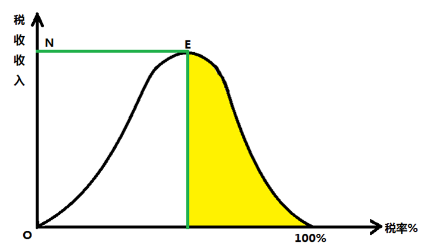

# 3.洞察组织

我们都身处人群，身处组织，那政治就无处不在，避无可避。政治不是简单题，我们只能拥抱它，理解它的复杂。

## 10 ｜解题：宁复杂，别简单

这一讲我们讨论的话题是：为什么越简单越没有出路。

有人寻找净土，有人遁入空门，有人想拨转时间回到过去，有人回归经典成为原教旨主义者，有人反身内求，在内心深处寻找自我，有人则弃绝自我，在坚强团结的小集体里找归宿，等等等等。

所有这些人有个共同点：面对人生种种难题，他们认为有一个答案，而答案就在于执一而从，一是简单，是纯净，是圆满，也是真、善、美。只要找到属于自己的这个一，然后固执之，践行之，于是外来烦扰内心忧惧统统退散。

想得美，没有的事。

### 为什么简单无出路

我讲三个理由。

**第一，滚滚红尘，绝无空门。**

人生的悲剧是稀缺，而稀缺永恒。稀缺对大多数人来说表现为缺钱，但远远不止于此，凡是你珍视的必然稀缺。稀缺伴随着你，到你去的任何地方，躲是躲不开的。

**第二，更复杂才是缓解复杂问题的办法。**

为什么我说的是缓解，而不是解决呢？因为解决不了。面对稀缺，要好比杂耍师玩锅盖盖锅的游戏。锅比锅盖多，要让锅盖看上去仿佛盖住了所有的锅，杂耍师得不停腾挪，锅盖翻飞，左盖右盖。玩游戏的关键，是锅和锅盖的数量要多才能掩人耳目。要是只剩下两口锅一个盖，就是水落石出玩不下去了。越简单就越难办。

举个现今社会的例子，为什么欠一万块钱是孙子，欠一万亿是爷爷？欠一万亿的锅盖多，多到一定程度，就叫作首富。

举个自然界的例子。虽然进化往未来看没有方向，但回溯的话我们能看到生物体变得越来越复杂，其原因是要最大限度适应环境。没有谁因为想逃避自己所处维度的难题，就想降维变成阿米巴虫这类单细胞生物。更何况阿米巴虫并不逍遥，它在自己的维度上有自己的难题，难度不会比高维生物的小，只是你不是它所以不知道而已。

稀缺永恒，人生实难，无论身在何处，哪个维度都是几个锅盖盖许多口锅，永远得靠左右腾挪。一味追求简单只是减少了腾挪空间，使游戏更难玩而已。

**第三，越简单就越无法回避悖论。**

跟稀缺一样，悖论也无处不在，而且环境越简单悖论就越坚硬。最简单的，我现在说句话：

“我说的这句话是谎话。”

请问这句话是真话还是谎话？你说它是真话它就是谎话，你说它是谎话它就是真话。

### 简单会走向悖论

悖论有点像但不是语言游戏。只要存在自指递归（recursive）就有悖论，而自指递归无处不在，正如包含所有集合的也是个集合。

我再举两个例子：

第一个例子讲宽容，小到待人处事，大到公共政策，都涉及到宽容。

首先，一味宽容是找死。如果你一味宽容，那么对于那些不宽容的人，你是宽容还是不宽容？宽容他们，等于纵容了不宽容。

同样的，绝不宽容也是找死。两个绝不宽容的人相遇，对彼此的绝不宽容，也是绝不宽容，最后互相毁灭，世界因此减少了不宽容。

第二个例子是桥水资本创始人达里奥在《原则》里说他在公司管理中用的讲真话原则。达里奥要求包括他自己在内的公司所有人极端诚实（radical honesty），对人对事有什么意见一定要当面讲出来。

总讲真话一定好吗？且不说一味讲真话太伤人这点事，更重要的总讲真话这事是靠不住的，迟早会走到它的反面。

假设在达里奥的公司桥水资本里面有人站出来，按照讲真话原则发表意见，认为讲真话原则不好应该取消。怎么办？

这主张要是付诸表决通过了，讲真话原则是取消还是不取消？如果说为了挽救讲真话原则，把它宣布为公司根本打法，在任何情况下都不得改变，行不行？把讲真话原则执行到底，迟早会使达里奥面临左右为难：要么取消讲真话原则，要么压制讲真话的人。

类似例子无穷无尽，他们说明悖论无处不在，所以一味简单不是什么好办法。简单到底，无非是赤裸裸地面对悖论。无论宽容还是不宽容，是不是只讲真话，都无法执一而从，进行到底。我们就是得有时宽容有时不宽容，有时坚持原则有时和稀泥。这不自洽不美观也不容易操作，但没有更好的办法，生活不容易，能混得混。

对混有洁癖，坚持要回归本源，寻找净土，皈依原教旨，这些可解决不了人生难题。就算上帝全知全能，为什么人间还有那么多罪恶？自省者认为必是我们有罪，自信者认为上帝错了，盲信者认为必有一个凡人无法理解的理由，凡人什么都懂，上帝还怎么超凡？

其实真相也许是这样的：面对永恒的稀缺、无处不在的悖论，上帝能怎么办？上帝也很绝望啊。

再换个角度来讲，社会是个大金字塔结构，细看大金字塔中又有无数个金字塔层层叠加，把镜头再推得更近细看，每个金字塔本身又是由无数个金字塔层层叠加而来。无论你走到哪里，都逃不出金字塔，如同孙悟空逃不出如来的五指山。

与其寻找一块想象中的净土，在其中倾注全部身心，到末了发现它不过是另一块金字塔，不如安心在社会大金字塔里闪转腾挪，不是说这里不难，但至少空间大，跳转机会多。如果你以为找到净土，最后却不过拴死在一座金字塔上，无路可去，那才是惨中之惨。

### 本讲小结

总结一下，给你三个建议：

**第一，宁可复杂，不要简单。**

社会难题无解，越简单这无解就表现得越赤裸裸。你只能往复杂上找出路，复杂它好歹还能给你个腾挪空间。

**第二，必须保持开放。**

封闭环境越走越死，不要封闭于自己，不要封闭于小团队，不要封闭于任何想象中的净土。

**第三，没有就地面对难题的决心和领悟，到哪里都是被难题追逐的命。**

世上没有桃花源，人生不存在容易解，只能直面复杂，扩展维度，能解决的难题解决掉，不能解决的缓解缓解将就混过去，而混的话，空间越大越好混。

反正，在长期中，我们都死了。

这一讲的灵感来自于《我的圣经狂想曲》（The Year of Living Biblically: One Man's Humble Quest to Follow the Bible as Literally as Possible），这本书的作者是雅各布（A. J. Jacobs），他是沉浸式报道的极度实践者。

什么是沉浸式报道呢？就是你要写什么，就把要写的东西原原本本经历一遍。他曾经把《大英百科全书》从头到尾读了一遍，然后专门写了本书就讲他学到了什么。

我受启发的这本书，讲的就是他闭关，不打折扣地按照《圣经》教义生活。他从头到尾整理出《圣经》的几百条告诫，原样执行近一年，结果自然是很惨。许多告诫跟现代行为准则差异太大只能算是小事，归根结底则是许多告诫自相矛盾。出关以后，他给其他人的告诫是：就算是《圣经》，你也不能都照着来，遵守什么你得挑。至于挑什么不挑什么，这问题还是只有你自己能回答。

### 思考题

我给你留一个思考题：

我举例举到了锅盖盖锅，为什么三个盖五口锅比一个盖两口锅更容易玩下去？锅盖总是不够用的话，最后指望什么来解决问题？

## 11 ｜规则：创新必须讲政治

这一讲我想给你讲，讲政治很重要，因为广义的政治躲不开，生活中随处都是，就连创新都要先过政治学这关。

### 政治无处不在

政治是什么，政治学家有他们的解释，我给一个广义解释：

> 政治是与法治相对而言的。所谓法治，就是追求一切由规则决定；所谓政治，就是追求一切由力量对比决定。

没有纯粹的政治，因为自从智人从森林里走出来以后，打架就都得在自己发明的各种规则之中打；当然更没有纯粹的法治，因为你我都知道，规则之所以存在，就是用来打破的。

在法治的理想里，政治不该有一席之地；政治的世界倒是可以部分兼容法治，法治是政治的工具，合适就拿过来用，不合适就放在一边，变成阻碍就打碎它。规则只能约束实力，实力却能制造规则。世界就这么现实。

所以说，由力量对比决定，而不纯粹由规则决定的地方就有政治，程度差别而已。你想躲也躲不开。

你经商，以为商业世界里是更好的产品，能获得更多市场带来更大利润，不见得。就说一个例子，在环环相扣的商业世界里，标准和联盟的作用越来越大。所谓网络效应，就是越多人接受一个产品/标准，就会驱动更多人接受同一个产品/标准。至于这个产品/标准本身相对于竞争者的客观优劣，只是多个因素中的一个，还不是最重要的那个。

比如说我们现在用的键盘的排列，其实非常奇怪：QWERTY，它并不是理论上最优的位置选择，只不过它一开始就是这样，被广泛采用了。所以大家都采用，我相信未来还会继续用下去。

你搞科研，以为学术是象牙塔。它可真不是。科学史家科恩在其名著《科学中的革命》里讲明白了，科学理论的“进步”，是通过科学家共同体放弃旧理论，接受新理论实现的。但驱动科学家共同体作弃取选择的动力，不见得是理论的“客观”优劣，它就是个由少到多最后越过临界点的过程。接受新理论的人多，新理论就赢了。

至于接受的人为什么越来越多？有可能是因为新理论有压倒性优势，但常常并非如此。你经常听到科学家们讲在两个理论中作选择的理由，比如说，被选中的那个理论需要前提更少，而可解释的内容更多，所谓奥卡姆剃刀法则。你可以说它是基于美感的，也可以说它是基于效率的，但你不能说它是客观的。大物理学家普朗克干脆说，一个理论之所以被接受，只是因为反对它的人都死光了。不管普朗克是不是反讽，但他说出了真相。

你搞变革，驱动创新，那就更需要讲政治。心流（flow）理论创始人契克森米哈利（Mihaly Csikszentmihalyi）在其名著《创造力：心流与创新心理学》（Creativity: Flow and the Psychology of Discovery and Invention）中说，创新有这么几个环节，少一环也不行：

- 第一环：专业领域及代代积累的专业知识（domain）；
- 第二环：专业领域的守护者(guardian)，也就是行业大佬；
- 第三环：你带来新想法(new idea)；
- 第四环：你带来新想法被守护者认可(accepted)。

你猜对创新来说最重要的是哪一环？

被专业领域的守护者认可最重要。

契克森米哈利甚至断言， **不被守护者认可的就不是创新。创新是由结果决定的，而不是常识以为的那样，反过来先有创新后被接受。**

说起来不公平，但这就是事实。有多少创新进入你我的视野，就有不知道多少个本来可以成为创新的想法湮没沉埋。无论创新相对于已有知识有多大进步，都绕不开争取本专业的守护者这一环。

### 如何获得同行的认可

人毕竟不是机器，一个算法搞定，跟人有关的事绕不开人际动力学。你不理它，它会理你，只能去拥抱它，问题是怎么拥抱它？

**首先，在守护者群体中，你要找对人。**

正如契克森米哈利所说，创新不是自己说了算，而是专业群体认可。专业群体指的不是你的客户群体也不是你的金主群体，而是你的同行群体。

沃顿商学院教授格兰特（Adam Grant）说，对一个新产品能否取得成功，投资人的意见是靠不住的，消费者调查得出的结论也一样靠不住。这两个群体都太重视既往经验。预测未来，谁的成功率都不会很高，相对而言最准确的预测来自同行。

小结一下， **最重要的既不是打动客户，也不是打动投资者，而是打动同行。**

我自己的经验可供印证，如果同行做新闻报道不得不引用我们，如果同行在读完别人做的新闻报道之后，仍然觉得必须读我们的新闻报道，作为一个新闻机构，财新就已经成功了。将来打动投资者和读者，是水到渠成的问题。

**接下来的问题是，哪些同行？**

你要找的是兼具内部人与外部人双重角色的同行。首先，他成长于体制之内，其次，他有一个外部的视角。

这种人其实也很难找，他往往会在体制的边缘。但他不能太边缘，他如果边缘化了，他也帮不到你。所以他既要有体制内的成长经历、资源动员能力、地位和影响力，又要具有外部视角。这种人很难找，如果你在职业生涯中遇到一个这样的人做你的领导，你非常幸运。

光是内部人的话，会宥于偏狭，所以总是高估一切变革的难度；光是外部人的话，不懂行，所以总是低估一切变革的难度。既是内部人又是外部人，才能既深入了解本专业又有广博见识，知道变革不易但可能。他们才是你最重要的同路人。

一个佐证，诺贝尔科学奖得主当中，懂艺术的比例远高于在科学家整体中的比例。艺术跟科学本身没有什么相关性，只是揭示了懂艺术的科学家能自由出入于自己的专业领域，这种人更有可能创造变革。

怎样争取这些同行的支持？

**第一，耐心积累实力，等待合适时机。**

你要改变一个领域一个组织一个系统，不能在自己还是毛毛虫的时候就动手。任正非说，谁要是一进公司就来跟我谈战略，我就把他开掉。小朋友，你还不够格。这不是势利，而是现实。在系统内部获得一定地位以后，说话才可能具有撬动杠杆的分量。

**第二，如果时机精准选择太难，那么慢比快好，时机不到就拖着。**

拖字诀的美德往往被低估，其实让它在时间中多发会儿酵比欠点火候总是好些。在推动变革这件事上，先发往往是劣势。古人早有这个智慧：帝王之兴，必有为之驱除者。第一个起来砸烂坛坛罐罐的往往成为先烈，最好的机会属于第二个起来打扫残局，拨乱反正的人。

**第三，隐藏剧烈变革的远大计划，把它分解成一个个不引人注目的小步骤。**

时势造英雄，是因为英雄在还没站起来的时候，已经为时势变化一步步做了许多铺垫。

**第四，少传教，多做事；少说为什么这样做，多说怎样做。**

首先是因为行胜于言，更重要的是做事情可作多重解释，如果能见度高对你推动变革不利，你就不要主动提高能见度。少说两句颠覆，多做颠覆的事。

**第五，当你力量丰满、羽翼已成的时候，要注意到，你想巅覆的那个专业、组织、系统里，维持现状的联盟，它的瓦解过程有独特的动力学.**

最早是单峰偏好，就是最保守派最看不惯你，其次看不惯那些次保守派；

最后会变成双峰偏好，就是最保守的固然看不惯你，但更看不惯那些反对你的程度没他那么激烈的次保守派。

面对新势力，旧联盟陷入内争，把内部的细小分歧看得比天还大：敌人可恨，叛徒更可恨，而跟我不一样的都是叛徒。

恭喜你，你就要赢了。

### 本讲小结

总结一下，这一讲我们讲广义的创新政治学。

哪怕是你想搞变革，搞创新，都必须讲政治。创新要想被采纳，核心是搞定同行，从政治的视角，我给了你五点建议。如果你有正在致力于创新的朋友，你也可以把这一讲分享给他。

这一讲的灵感来自于《心流》的作者契克森米哈利，《创造力：心流与创新心理学》。

### 思考题

我给你留一个思考题：

颠覆一个行业或者领域，第一个去颠覆的人往往会失败，而第二个去做的人，成功率会高很多，为什么？

## 12 ｜战略：人际斗争有万能打发

这一章前面两讲，我们说了简单无出路，政治躲不开。再强调一次，所谓政治，我这里是广义的，指所有得凭力量对比才能解决问题的场景，那些只要查找对比法律、规则就能解决问题的场景不算。在绝大多数场景里都得靠力量对比，这一讲，我跟你讲在这些场景里面有个万能打法。

### 万能打法的精髓

曾有一位大机构负责人乐呵呵地跟我说，政治很简单，就是要搞得朋友多多的，敌人少少的。他说的不算错，却只说到了最后力量对比这一层。人多胜算大，但是分配的时候人多就不好了。

**最好是打的时候人多，分的时候人少。**

精髓就这一句话，不同年代不同体制下都管用，本来是大玩家们不立文字的底层能力、秘传心法，终于被梅斯奎塔（Bueno Bruce de Mesquita）梳理出来公之于世。

梅斯奎塔是美国政治学家，当过美国政治学会会长，治学的路线是现实主义政治学。现实主义政治学，用马基雅维利式格言一句话概括：没有永恒的朋友，只有永恒的利益。多补充一句的话，政治的各种面相，是因为利益的不同底层结构。

这两年，玫瑰色褪去，世界变得险恶又狰狞，跟现实主义的视角和预言贴得越来越紧。风水轮流转，转到了这一节。

你也好，我也好，每个人本来就是有点理想，而以现实为本，只是此时已入冬，大家都比以前更现实，你不多用点现实主义理论武装自己，怎么过得去这个冬天？

万能打法就是一句话：打的时候人多，分的时候人少。想得倒好，怎么实现？

决窍是一个世界观和三个维度。

### 万能打法的世界观和维度

一个世界观，指驱动玩家的首要动力是获得权力，以及获得权力以后保持权力。这不用多说，是现实主义的经典假设。

三个维度，指玩家考虑力量对比的时候要看三样：名义支持者（nominal electorate）、实际支持者（real electorate）、制胜联盟（winning coalition）。

名义支持者指所有潜在支持者，实际支持者指那些有分量的支持者，制胜联盟指那些缺少其支持你就完蛋的实际支持者。这三者的关系是这样的：名义支持者可替代，实际支持者有影响，制胜联盟不可或缺。

在名义支持者、真实支持者、制胜联盟三个维度下，梅斯奎塔用绝对现实主义的分析框架，重新梳理从政客到 CEO 的行为逻辑，谱出一部现代厚黑学。

比如说，在这个三维视角下：所谓民主体制，就是制胜联盟很大，实际支持者更大，大到跟名义支持者差不多。所谓威权体制，就是名义支持者很大，实际支持者较小，制胜联盟极小。药都是这几味药，只是配方组合剂量不同。民主与威权都在同一个光谱上，没有截然区分的鸿沟，只是场景不同。

无论哪种场景，把万能打法落实到具体路线，也是同样的五条细则：

**规则一：制胜联盟越小越好。**

只要是能打赢，制胜联盟规模越小，分配的人就越少，而且人越少你就越好控制。

**规则二：名义支持者越多越好。**

名义支持者越多，实际支持者和制胜联盟成员的可替代性就越强，所以就越听话；这逻辑同样适用于实际支持者，也是越多越好。

**规则三：控制住关键资源。**

惟器与名不可假人，地位和名分最重要，这是老祖宗的告诫。现代社会跟这个稍有不同，关键资源主要表现为钱。

**规则四：你的制胜联盟不能养得太饱。**

太饱不利于他们继续保持忠诚。老祖宗也有同样的智慧。三国时代，就有智者这样来规划对史上第一大反骨仔吕布的使用：要像养鹰一样用他。让他适当保持饥饿感，他就继续给你干；一旦让他吃饱，他就飞了。

**规则五：关键词是适度保持饥饿感，你可不能真的让制胜联盟饿着了。**

真饿着了他就吃你。你得保证胜利联盟的利益，绝对不能从他们的口袋中把钱掏出来给别人，无论是名义支持者还是实际支持者。实在要发善心的话，你得用自己的钱。

透过万能打法及五条细则的棱镜看过去，历史成败突然就清楚了。

几乎没有人违反过第二条，也就是名义支持者越多越好，哪怕是帝国时代，帝王也要讲“天下为公”这套话术，连盗贼都要讲“替天行道”呢。至于个别连这套话术都不会，直截了当说死后哪管洪水滔天的，很快就真的死了。

崇祯皇帝违反了第五条，他让自己的制胜联盟真的饿着了。大明王朝直接亡于满清，死因则是财政崩溃，国家没钱了。如果不是因为财政没钱裁撤了陕西“邮政”，“邮政员工”李自成怎么想得起来造反？不过，崩溃的是国库，内帑——就是皇家小金库——一直都很有钱。

终局时刻，满州兵临北京城下，众大臣上书请开内帑劳军。崇祯舍不得，把上书的人拿下，廷杖，转头下诏要众臣散财救国。结果可想而知。崇祯在景山走投无路时，只有一位太监在身边，众叛亲离到极点就是这样的。

### 万能打法在商业场景下的应用

万能打法不仅读懂帝王事，也能在今天的商战中实操。你看马云运筹了十年，终于把阿里巴巴的控制权安排妥当，跟万能打法的要求丝丝入扣：

**规则一，制胜联盟越小越好。**

巨型互联网公司一般历经多次融资，股权高度分散，管理团队很难掌握控股权。如果按公司治理的一般原则，名义支持者是全部股东，实际支持者是实际参加投票的部分股东，胜利联盟则是投支持票的那部分股东。

无论是哪一层，马云都觉得不够放心，至少是不能长期放心。通过转出支付宝立威，然后将同股不同权坚持到底，绝对地丝毫地不退让，最终重构了阿里的权力三维结构：名义支持者是全部股东，实际支持者是董事会成员，制胜联盟则是阿里合伙人机制。36 名马云一手挑选的阿里合伙人有权推选多数董事会席位，牢牢掌握阿里体系的控制权。

**规则二，名义支持者越多越好。**

阿里全员持股，实际上可能性很小但每个人理论上都有潜在的资格成为阿里合伙人一员。36 名现合伙人一方面分享了阿里系的真正权力，主宰数千亿美元市值资产的走向，利益之大可想而知；另一方面又被置于一个必须始终保持饥饿感的位置。

合伙人分出两层，一层是内核中的内核，马云和另外一人是终身合伙人，另一层 34 人则并非终身合伙人，根据年限、表现以及虽没明说但显然最重要的忠诚度有退出可能，事实上也发生过几次合伙人退出事件。这些安排将万能打法的规则三、四、五融为一炉。在制胜联盟里分配关键资源的分寸感，是这套万能打法关键中的关键。

看懂这套打法，你就知道马云宣布退休其实是无所谓的，就是日常事务懒得管了而已，但凡能不管的话谁爱管这些劳什子呢？控制权牢牢在握就行。马云也许没有读过梅斯奎塔，但一法通万法通，做到极处无师自通。

对你来说，只要是在取胜需要依靠力量对比的场景，先想想这套万能打法。

### 本讲小结

总结一下，我们这一讲的万能打法，就是要解决一个千古难题，怎么做到打仗的时候人多，分配的时候人少。万能打法的关键在于运用名义支持者、实际支持者、制胜联盟的三维结构。运用之妙，存乎一心，我们共勉。

这一讲的灵感来自于一本书，梅斯奎塔写的《独裁者手册》（The Dictator’s Handbook）。你不必被“独裁者”这三个字吓到了，其实我觉得这本书更好的名字叫做《万能的政治打法》，学会这套打法对你有用。

### 思考题

我给你留一个思考题：

我讲了古今很多万能打法的应用实例，你有没有见到过这套万能打法的应用实例？

## 13 ｜关系：不可不铁，不可太铁

这一讲我们来看看怎么搭关系网。

人生而自由，却无往不在关系之中。每个人都有三样资本：人力、财务、关系。假设人力和财务资本相同，谁更会搞关系谁获利大。关系网是人生的重要资本，有时是最重要资本，对此我们中国人都心领神会，毕竟用拼音写的 guan xi 这个词，都进入英语词汇表了。

真正会搞关系的人是人生赢家。他知道哪里有好机会，有好机会都能插上一手，好机会离了他还真不行。

你知道怎么搭关系吗？

搞关系不是讨好大人物。虽然马基雅维利说过，需要讨好大人物的话那就去讨好，但把讨好大人物当成搞关系的核心，反而恰恰是不会搞关系。

中国人谁不会讨好大人物，关系大师有几个？大人物是怎么变成大人物的？反正不是靠被人先讨好后利用。正好相反，你看大人物跟人打交道，总是他在占便宜。为什么？大家都想讨好他呀。你跟几个大人物换过名片，有他的手机号微信号，那不是关系资本，搞不好是关系负资本。

就算你幸而成功，跟大人物有了深交，成为他的一颗棋子、一杆枪或者一副白手套，那也就是解决了饭碗问题。哪怕你捧的是金饭碗，干的还是讨饭这件事。你有关系却丧失了自由。

真正会搞关系的人，他跟关系网之间的关系是狗摇尾巴而不是尾巴摇狗，他用关系网而不为关系网所用。不为关系网所累，却在关系网中获得自由。 **做到这些，他靠的首先不是找对他有用的关系，而是把自己放在关系网中对人有用的位置。**

关键不在于关系网中有什么人，而在于关系网是什么结构。关系网中有什么人不是不重要，但更重要的是关系网怎么搭。

### 帝王关系术

我给你讲讲帝王是怎么搭关系网的。

大臣无私交，是历代帝王最重要的一条政治规矩。大臣之间不能私下往来，不能随便串门，更不能互通信息，互相勾结就更不用说了，最好连历史交情都没有。

中国人自小生长在关系之中，袍泽、同乡、同科，等等等等。帝王强势，则这些关系受抑制；帝王弱势，则这些关系见风就长。

这条规矩如此不近人情，为什么还如此重要？因为如果将它进行到底，最后呈现出来的是对帝王来说最理想的一张关系网。

“为政以德，譬如北辰，居其所而众星拱之。”北辰就是北极星，你把“以德”两个字拿掉，《论语》已经勾勒出这张关系网的要点。帝王居中，大臣环绕，所有连接都发生在帝王与大臣之间，大臣之间没有连接。

这张关系网对帝王来说没有冗余（redundancy）。关系网的冗余有两个来源：凝聚力（cohesion）和同构性(structural equivalence）。

为什么呢？下面我们一个个来解释。

先谈凝聚力。你可能觉得关系网有凝聚力是好事，谁不想自己的关系铁呢？不谈感情就谈网络结构的话，凝聚力指网络中的每个人彼此熟悉的程度。在最有凝聚力的关系网中，每个人都认识每个人。

再谈同构性。你的两个关系人彼此不一定认识，但这两个人能帮你接入的下一层关系网，两者是一模一样的，那么，这两人在你的关系网中就是同构的。

### 冗余关系网

讲到这里，请你先反思一下自己的关系网。如果你的关系网凝聚力极强，所有朋友都认识所有另外的朋友，如果你的关系网同构性极强，你通过所有人接入的都是同一个关系网，那么你麻烦了。

你的关系网太铁，带来两大致命问题。

- 第一，你能获得的信息太少。这个关系网中没有新信息，即使偶尔有新信息也是所有人同时知道，而大家同时知道的信息不能给你带来任何额外价值。
- 第二，你没有用。不管你的关系网有多么铁，你完全没有额外价值，你所知道的，别人也都知道。你对别人没有用，完全可被取代。

你跟这个极度冗余的关系网的关系是这样的：你对它没有什么价值，它却是你的全部。在它之中，你所获无几，还丧失了自由。一旦从这个关系网中被放逐，你就一无所有。

到这里你该明白了，帝王的理想关系网正好是冗余关系网的反面。大臣无私交，术语就是没有凝聚力，谁跟谁都没有连接，所有连接都通过帝王；大臣各有职责，经由他们通向的下一层关系网也彼此不同，所以不同构。

### 结构洞，从关系网中套利

既没凝聚力又不同构的情况，社会学中叫作结构洞（structural holes）。之所以叫作洞，是因为关系网延展到这里好像是掉进了洞里，大臣无私交，无私交就产生了洞。

结构洞是个缓冲地带，又像电路中的绝缘体，结构洞两边传递着不同的信息流。关系网中跨越了结构洞的人，有了在两种信息流的居间套利机会：何时何地连接谁连接多少？这就是权力。拥有这权力的人获得利益。

从结构洞的角度来看帝王的理想关系网，有两个特点：

- 第一，关系网充满了结构洞。
- 第二，结构洞全在其他人那一边，帝王这一边完全没有结构洞。

在帝王的理想关系网中，只有他能跨越结构洞，所有信息流全部通过他。帝王知道一切，其他所有人只知道自己这一点，其余的要看帝王愿不愿意告诉他们。什么时候，告诉多少，帝王说了算。帝王也可以在最恰当的时机干预一切，连接两个人，让他们合作，或者让他们争斗。

为君之道，本质上是一个，叫掮客、叫渔翁得利都行，关键是只能有一个掮客，一个渔翁。惟一的桥带来绝对的权力，绝对的权力带来绝对的利益。帝王的核心竞争力，帝王术，就是在治国精英关系网中获得并保持住这个位置。得之则有国，失之则丧身。

在这个理想关系网中，只有帝王是自由的，关系网结构保证了只有他有自主权（structural autonomous）。关系网离开他就崩塌，而他又超然于每个关系，无论哪个关系都不能反过来威胁到他，无论哪个关系出问题都是癣疥小疾。他明见万里，应时而动，英明神武，不是因为天生如此，只是因为占住了关系网中惟一的关键位置。

帝王付出的代价是孤独，他有多自由，就有多孤独。子民、属下、朋友、亲人，在他都必须是结构洞那边的人，只能是他一个人超然其外，所有人都需要他，他不需要任何人。

好在这不是你用得着担心的事。你只需要借鉴帝王的理想关系网，用结构洞理论梳理打造自己的关系网。

展开来讲：

**第一，既有关系网中的结构洞越多越好。**

结构洞越多，意味着你跨越多个群体并在他们中间作中介的能力越强，你越能获得更多高质量信息，获得的时间越早，每个群体也越需要你。

**第二，跨界收益递增。**

你跨越的群体越多，你就越有价值。价值不是线性递增而是指数增长。你跨越的群体越来自不同的方向不同的领域，你跨越的结构洞也就越多，而每多跨越一个结构洞，你关系网中已经存在的结构洞价值也会增加。

同时，你已经跨越的结构洞越多，对你跨界的能力也越有帮助，因为你对新群体越有价值，新群体越有动力接纳你。这是个正反馈，关系网越有效的人越能延展关系网。不必讨好谁，有用就行了，做桥最有用。

**第三，同质关系收益递减。**

你不需要认识每个校友每个同事每个同行，每个群体熟悉几个节点就够了。如果只从效率考虑，每个群体熟悉一个关键人，掌握一个关键节点，就够了，但如果真这样的话，那么这座桥同时掌握在你和他手中，你依赖他才能跨越结构洞，正如他也是依赖你才能跨越结构洞。你们彼此套牢。你解套的办法是至少要在他之外多布一个点。林彪指挥百万大军，但时常越过指挥系统，直接指挥到连队，其实领导都需要这样。

**第四，你的关系网跨越越多的群体，有越多的结构洞，你就越自由。**

自由不是自己一个人想做什么做什么，而是与他人有独特丰富的关系，关系越独特丰富，你就越自由。不想搞艺术的科学家不是好商人，混搭，随时出入于多个群体而不为任何一个群体所限的人，是人能获得的最大自由。

说完这些，还得对你有个重要提醒。凡事不要做绝，你按结构洞搭关系网也不要做绝。人人都有亲人、朋友，这些人生中的核心关系当然有用处，但他们不是拿来用的，他们是我们的身心滋养，是我们安全感的最终源泉。许多成功者说成功是与自己最重视的人，有丰富饱满凝聚力极强的关系，我相信他们说的是真话。

### 维也纳小组

这里说的还只是情感，即使在情感之外，就谈理性算计，要将含有多结构洞的关系网的能量发挥到极致，一个人远远不如一个团队，成员相互信任，凝聚力强，各有特长。人类的大多数创新来自于拥有这些特点的小圈子。

2000 多年前的雅典学院将古希腊思想发扬光大、100 年前的维也纳小组重塑 20 世纪思想史、30 年前的中国社科院体改所群英开枝散叶，成为中国经济改革的中坚力量，都属于这一类。

我讲讲维也纳小组的故事。第一次世界大战后，以维也纳为中心聚集了一群知识精英，重塑了 20 世纪西方科学和哲学思想，分析哲学、当代科学哲学都从这里发源。

维也纳小组的构成符合典型的结构洞理论，其成员有维特根斯坦、波普尔、哥德尔、卡尔纳普、石里克，来自物理学、数学、逻辑学、哲学的不同圈子。作为一个整体，小组跨越了许多结构洞，打通多个学科，新思维相互启发。

维也纳小组也超越了典型的结构洞理论，所有成员都认识所有成员，定期交流，彼此激发，凝聚力极强，致力于在相对论和量子力学兴起的时代为科学寻找可靠基础，成为 20 世纪分析哲学和科学哲学的正源。

其实，我也在维也纳小组关系网之中。我的导师的导师是洪谦先生，他的导师石里克是维也纳小组领袖，洪谦先生本人也是小组一员，我算是小组的三传或者四传弟子吧。

帝王学将结构洞做到绝就够了，伟大的事业则往往来自高水平、彼此充分信任、背景多元化的亲密小圈子，这就要求有克制地部署结构洞。

跨越再多的结构洞，到最后我们还是要与同道中人在一起，相互激励，彼此慰藉，才能迸发出整体最大能量，有所创造。要是失去分寸，学关系帝王术学到一丝不苟，即或成功，大家都被你一网打尽，但你也不过变成孤家寡人。

### 本讲小结

总结一下，这一讲告诉你：

**搭关系，不要想别人对你有什么用，要想你对别人有什么用，而你对别人的用处大小，不在你本身，而在于你在关系网结构中的位置。要站在跨越最多结构洞的网中。同时你也要记住，这件事也不要做绝。**

这一讲受到卡尔·西格蒙德（Karl Sigmund）的书《癫狂年代的精确思考》（Exact Thinking in Demented Times）的启发，出身维也纳学术圈的当代学者写维也纳小组的故事。刚才讲过我算是维也纳小组的多传不肖弟子，举贤不避亲，把这本书推荐给你，体会一下现实中结构洞关系学的最优用法。

影响了这一讲的还有另一本书，《结构洞：竞争的社会结构》（Structural Holes: The Social Structure of Competition, by Ronald Burt），如果你要精研结构洞关系学，推荐给你。

### 思考题

最后，我给你留一个思考题：

请讲讲你看到的小圈子大能量的故事，他们是不是与结构洞关系学暗合，又怎样避开了它的陷阱？

## 14 ｜情感：越亲密越脆弱

上一讲我们讲了关系的结构，这一讲讲关系本身。

关系就是你与他人的连接，它不仅有功利之用，还有情感之用。人各有其幸福的定义，但没有一种不伴随着与他人多元、丰满、充实的关系。反过来说，关系之中有陷阱，所谓知人知面不知心，当你发现被信任的人欺骗出卖，会感觉更为苦涩。

这一讲想告诉你，关系的陷阱往往是你自己挖的。

### 为什么关系越亲密越经不起挑拨

没有绝对靠得住的关系，问题只在于你如何面对它、管理它。

我不必像马基雅维利一样冷酷地剖解“没有永恒的朋友，只有永恒的利益”，只需要提醒你认清你自己就行。

关系从外到内一层层变得越来越紧密，跟你关系最紧密、最可信赖的人就是你自己了。但就算是你自己，也不是同一个人。

今天的你和明天的你就不是同一个人，否则就不会有新年立志、年中放羊、来年再立志这套循环把戏了。新年立志的你，想套牢年中的你，年中的你则摆脱了新年的你的束缚。不同时空中的你连偏好都不同。就算是在同一时空中，你也不止一个你。爬行动物脑是一个你，任本能驱动；前额脑是另一个你，靠算计行事。两者冲突的时候，顺人欲还是存天理？事到临头才知道。

自己都靠不住，何况是别人！诚意正心、格物致知、修身齐家治国平天下，中国人的关系网自内而外，层层外扩，层层衰减，没有哪一层绝对靠得住。

道理不难懂，为什么你还会因为过度信任而掉入关系的陷阱？

因为正常人不会处理极大概率和极小概率事件。99%概率会发生的事情，正常人就把它当作必然会发生；1%概率会发生的事情，正常人把它当作肯定不会发生。大脑不能始终在那里计算尾部事件的微小概率变动，就现在这样已经耗费一个人日常所耗能量的 20%了，要是整天算微小的概率变动，会过热死机。

所以，当你觉得一个人相当可信，虽然你早知道没有人绝对可信这回事，但大脑就不自觉地默认成完全信任他。你把受欺骗的极小概率事件当作不会发生，这样比较节约能量。

最终导致一个悖论：关系越紧密就越经不起挑拨。千里之堤，毁于蚁穴，凭什么啊？因为要求高一点都伤不起啊。关系越紧密，彼此要求就越高，你默认对方完全靠谱，那么对方没达到你预期，不管是事实上的还是你想象中的，对你的伤害就越大。

读《资治通鉴》到董卓专权那一段，我读到的就是一连串亲密关系轻而易举地就崩解了。

话说东汉末年，董卓率领西凉军人集团夺取朝政，废立君主，大权在握。然后为了貂蝉与吕布父子相残，这桥段历史上发生多次，不用我细讲了，我讲接下来发生的事。

两人火拼后，朝廷发难，杀死了董卓。诸侯进逼，西凉军人集团群龙无首，危如累卵。董卓的两大部将李傕、郭汜好不容易统住西凉军马，暂时稳住局面。你看，在这种情况下，两个人本来就是至交好友，又是内忧外患的生死关头，按理来说更应该精诚团结。可就因为两个人的太太闹了点矛盾，搞了点小花招，结果就生生拆散了两人的生死盟约，内斗了起来。最后两败俱伤，都落了个不得好死的结局。而整个西凉集团也土崩瓦解，从此分散在四方，沦落成了其他势力的打手。

从此我读《资治通鉴》，每看到曾经的好朋友之间“有隙”两个字，就是有了缝隙，生了嫌隙的意思，心中便是一紧，一般来说，下一页这两人就会刀枪相见。

我们皆凡人，好朋友之间容不得有隙，越好越不能有隙，有隙便有大事。

### 挑拨守恒假说

从这里外推，我试验性地提出一个 “挑拨守恒假说” ：

无论是一对死敌还是一对至交，挑拨他们之间关系的难度是一样的。死敌之间你用不着挑拨，他们自己打得你死我活，但你想进一步挑拨的话，需要极多的信息和操纵；至交之间虽然情比金坚，但只要你能插进一点缝隙，英语叫作 drive a wedge，离挑拨成功就不远了。

仔细想想这个挑拨守恒假说，人与人之间的关系就是这么既真实又脆弱，带给我们温暖也带来伤害，有多温暖就有多容易变成伤害。因为大脑默认极小概率事件不会发生，而当两人生隙，出现信号，让我们突然意识到它有可能发生时，就是从 0 到 1，波动不可能平滑渐进，一定会发生剧烈的相变。好比水突然从液体变成了气体，这样的状态切换。

我再用期权来讲这个道理。

期权（option）就是以某个价格在某个时间买入或者卖出某样东西的权利。期权有很多种，其中一种是深度价外期权。比如一只股票现在价格是 10 块，你卖出它的看涨期权，期权行使是一年内，行权价格是 100 块，这就是深度价外期权。

因为股价一年内从 10 块涨到 100 块的可能性极小，期权到期价值等于零的可能性很大，如果你是卖方就白赚了，极小概率的事不会发生嘛。但是，只要股价出现大幅上涨，那么期权价格的上涨很可能会猛烈得多，搞不好股价才涨一倍、期权价格涨十倍。这时卖家就惨了。当默认不会发生的事情被重估为有可能发生时，通过价格表现出来的人们的反应是疯狂的。

我的本职工作是新闻，多年来主持《财新》这家优秀新闻机构的编辑部。许多人眼中新闻就是追逐负面，其实不是，新闻追逐的是小概率事件它竟然发生了，追逐的是意外，只不过意外中大多数是负面而已。可以说，新闻报道的主要就是不应该发生但却发生了的事情。多年新闻工作下来，我知道极小概率事件随时都在发生。

比如说，河道干涸了很多年，人们在里面盖房子住人，遇上两百年一遇的暴雨，泥石流下来，玉石俱焚。这种事各地都有。人命本无价，两百年一遇的事情毕竟终有一遇，人们不知道怎么面对这个小概率事件，于是默认它不会发生。这就跟人们都知道不存在绝对可靠的交情，但还是免不了被它伤害是一样的道理。

### 处理关系的五个建议

明白了这么多，你怎么办呢？我有几个建议：

**第一，越是亲密关系越要精心滋养。**

越亲密的关系越容易生隙，而一有隙双方就容易过度反应。绝不要以为关系深厚就可以为所欲为，正好反过来，关系越深厚越需要精心维护，关系越坏才可以越为所欲为。

**第二，亲密关系之外的其他关系，重在用人不在识人。**

知人知面不知心，你又何必去知心！如果你是管理者，就更应该把重点放在用人所长，而以绩效为先，把握能把握的。管理学大师德鲁克（Peter Drucker）观察管理大师斯隆的（Alfred Sloan）用人之道，就是这个心得。

斯隆是通用汽车的传奇 CEO，把通用一手推向巅峰，一度成为美国经济的同义词。斯隆留下这句包含悖论的名言，他说：“人事极为重要，但不要过多在人身上浪费时间。”因为以绩效为先，人事迎刃而解。斯隆最重视人事，但性格冷淡，不好相处，这悖论对他是正好。

**第三，用人不疑疑人不用，这是不对的，正确的是“用人也疑，疑人也用”。**

前者简单后者复杂，我们都喜欢简单，可现实就是复杂的。你如果觉得这样想太过现实，那就多想想疑人也用这半边，它可比疑人不用要正能量得多了。

第四，在干涸的河道里不能盖房只能种田，两百年一遇的大水冲走一年收成，你不会亏光。盖房子则不然，**只要存在亏光的风险，不管风险多么小，就不能全押。**一次没赔，两次没赔，老这样干迟早赔光。这道理同样适用于管理交情。大脑不适合用来精算，但轻重得分清。

最后也是最重要的，**你可不要以为没有什么关系绝对靠得住，就伤心失望从关系中抽身而退，正好相反，没有一个关系绝对靠得住，所以你应该扩展关系。** 多元、丰满、充实的关系网，特别是多元、丰满、充实的亲密关系网，而不是情比金坚的单一关系，才是我们情感的归处、安全的来源。

### 本讲小结

总结一下。

这一讲，我告诉你越亲密的关系越是脆弱，越是需要你精心呵护滋养，而原因是我们的大脑不能处理小概率事件的微小变动。反过来说，不要过度依赖任何单一关系，无论它看上去多么可靠。

这一讲的灵感，来自通用汽车传奇 CEO 斯隆（Alfred Sloan ）的自传《我在通用汽车的岁月》（My Years With General Motors）。

当年，管理学大师彼得·德鲁克接到了工业巨人通用汽车的邀请，这是有史以来第一次以一位外人的身份在企业内部的深度研究，其成果《公司的概念》（The Concept of Corporation）成为管理学的开创之作。不过，斯隆对这本书不满意，又写出自传，也就是本书《我在通用汽车的岁月》。这是关键内部人对通用兴起的自我解读，也成为管理名著。一个公司，两种解读，引出两本名著，成就一段佳话。一个是评论做事的，一个是做事的，我把做事的人的书推荐给你。

### 思考题

给你出个思考题：

你原来以为不可能发生的事情结果发生了，你的反应是什么？举个例子。

## 15 ｜资源：别清空存量，清空存量思维

这一讲我们来讨论下怎么处置你的存量。

罗振宇跟我说过一句话，“我和脱不花这种人，不把存量当回事，随时准备清空”，罗振宇边跟我说这话边跟脱不花确认了眼神。我一是受到震动，如此果决，真了不起；二是隐隐觉得哪里不对。这样真的好吗？

原教旨经济学家会觉得这是理所当然的，沉没成本不影响未来决策。过去的一切凝聚成现实，而现实到来的那一刻就已不可改变，惟一重要的是未来。这是教科书式的正确答案。但是，人们在现实中则多半不会如此行动。我们都是自己过往经历塑造的产物，谁也不是只往未来这一个方向看，难道我们都做错了吗？

这可不是抽象的哲学问题，它小到影响你要不要跳槽，要不要放下一切去追求梦想，大到影响我们今天在过去与未来之间的取舍。这问题在我后脑勺发酵了好久，终于，在打一局围棋谱的时候，我想明白了。

### 人生好比一局围棋

围棋是最古老的战略游戏。规则极为简单：棋分黑白，纵横十九，气尽则亡，子多为胜，剩下的规则都是打打补丁，却能生发出无穷变化。

一盘棋，少则百余手，多则三百手以上，每个对弈者落子次数大概率在五六十次到一百五六十次之间，而真正需要作出决策的次数大概占到其中 1/3，也就是说一盘棋需要作的决策次数是十几次到五十次左右。

这跟现实同构。围棋可以看作是对现实的抽象：规则很少很简单，但变化极多，未来难测，你可以作计划，但得随时迎接变化。

人一生中所作的重大决策，上学、找工作、换工作、谈恋爱、婚姻、生儿育女、退休、投资，再平淡的人生中也会有一二十个，你要是人生激荡的话，多到五十来个重大决策也正常。这跟巴菲特说投资差不多。他说，全部投资生涯总共作的重大投资决策加起来 20 个左右，其他的都是小事。

围棋是关于棋子效率的游戏，子多为胜是其结果。作出几十个决策，布下一百来个棋子，如果这些棋子整体发挥出比对手更高的效率，你就赢了。现实也差不多，没有赶尽杀绝才算赢这回事，自己觉着活得比别人好就是赢，它同样取决于你作出的那几十个人生重大决定。

效率可以这样来描述它：

假设第一步的效率是 X1，第二步是 X2，第三步是 X3，到最后一步 X150，你这盘棋的整体效率不是作加法，X1+X2+……X150，而是作乘法，X1*X2*……X150，整体效率是每步棋效率的乘积。

有三点很重要。

**第一，每个决策都很重要，而且跟先后顺序无关。你的任何一个决策都不能是致命的，如果是，那它发生在开局还是终局都没有影响。**

常识说人要犯错误要在年轻的时候，这说法之所以算是成立，是因为年轻人天然地同时下着好几盘棋，比如说要是他炒股失手全亏光了，但人力资本还在，能补回来。如果年轻人只有一盘棋可下，那什么时候亏光都是亏光，没有区别。

推论是环境中存在的机会越多你越可以从容，机会越少你就得越谨慎小心，因为搞砸了没有翻盘机会。一个人在北上广能放飞自我，如果逃离北上广回到老家，就得夹起尾巴做人。人没变，环境变了。

**第二，围棋盘上做不到，但在现实中你要尽量做到使每一步都是个组合。**

原因很简单：

假设你要做两件事，一件事的预期收益是翻倍，另一件事的预期收益是亏一半，而你不知道哪件事会翻倍哪件事会亏一半，这时候你怎么选？

如果你先做一件再做另一件，串联，那么预期收益是 0，先翻倍后腰斩，或者先腰斩再翻倍，总之是哪里来的回哪里去；但如果你同时做这两件事，并联，那么预期收益是 25%，一半翻倍另一半亏一半，合起来是百分之百减去百分之五十再除以二。风险变小，收益变大。永远不要同时只做一件事，不要听那些 All IN 的口号。

**第三，落在盘上的棋子也不能动，落子无悔，好比人生也没有重来，但是，棋子虽不能动，你的下一步落子，却可以让已经落下的子的效率发生改变。**

棋子的效率不是固定不变的，始终在变化之中，视对手的应对，视自己接下来的落子而变。从这个角度看围棋，可以把每步棋的使命都看作是尽可能提升已经落下棋子的效率，谁实现得更好谁就赢。

我们的人生决策也是一样，新决策一定要让过往的所有决策整体绽放出最大效率。你无法事先把一盘棋全部都规划好，这是不可能的，你的智慧不允许，你的对手也不允许，但棋是一步步下的，每下一步棋都要努力让已经下的棋发挥更大效率，这个目标是可能实现的。 **一步好棋是它对得起盘上的棋子，你的一个好决策则是它对得起你过往所作决策的总和。**

过去并没有真的过去，它是可以被未来改变的。 **存量是不能被清空的，因为存量不是沉没成本，存量也是变量。围棋帮我想明白了这个道理。**

### 应该清空存量思维

那罗振宇、脱不花错了吗？

倒也没有。

存量是不能清空的，正如你不可以把棋子从棋盘上拿掉，但也可以让已经放到棋盘上的棋子发挥出更大效率；可以清空的是存量思维，因为我们不能被自己此前所作的决策所限制。不能因为过去有一个构想，就认为它必须延续到将来。不能因为对自己有个定位，就认为这个定位必须捍卫到永远，否则我将不我。

情况变了，看法就得改。有人指责大经济学家凯恩斯看法改得太快，凯恩斯反问：先生们，难道环境变了，你们不改变看法吗？

不过，绝大多数人确实不这样做。人类棋手之所以在围棋上输给 AI，就是我们太受制于存量思维，困在自己最初的构想之中。我们下前几步棋的战术目的是什么，后几步棋就鱼贯而来，我们或者把它叫作棋理，或者叫作棋风，或者叫作气合，就是斗气。

最极端的例子是日本围棋黄金时代的超一流棋手大竹英雄，他被称为围棋美学派代表人物，留下了一句名言：如果不下这步棋就输了，那我也不能下！因为那步棋的棋形太难看了。你可能会笑话大竹英雄，但生活中太在意立场姿态世界观的人，跟他有多大区别呢？

人的这些毛病，AI 统统都没有，它审视棋盘，不管此前下了多少步，它把当下视作起点，把接下来这步当作第一步来重新开始计算。正是因为清空了存量思维，它才能够清醒地评估存量，拿出此时此刻最大化重构存量价值的策略。一盘棋下来，它这样做的次数比人类多太多。

### 本讲小结

好，总结一下，这一讲讲到了三种思维方式：

第一种思维方式基于自我认知（identity driven）：我是什么样的人？我们是个什么样的组织？如果我做了这样那样的事，我还是我吗？我们的组织还是以前那个组织吗？

第二种思维方式随时准备清空存量，只看自己想去的那个方向，想要达到的那个目标。爱情诚可贵，理想价更高，若为自由故，两者皆可抛。爱情、理想、自由这几个位置自由代入各种关键词，就得到了这种去存量打法。

第三种思维方式随时清空存量思维，但珍视存量，因为存量也是变量。这种人不关心定位，所谓自己是什么样的人，身处的是什么样的组织，而是聚焦于如何使自己的存量接下来发挥最大效率。重新审视棋局，随时刷新思路。太阳每次升起都有一个新我，苟日新，日日新。

这一讲的灵感来自于一本书——《三十六计与围棋》。作者马晓春是我国第一位围棋世界冠军，也是在棋手这群聪明人中被公认为最聪明的那一个。我们这一讲讲了围棋对思考现实的启发，而这本“围棋三十六计”则是棋盘争斗与现实竞争的全面映射，两个方面都是顶级内容。如果你略通围棋及以上，一定要找这本书来看；如果你不通围棋，遗憾，你错过了很多。

### 思考题

我给你留一个思考题：

这三种思维方式，第一种始终基于自我认知，第二种随时准备清空存量去实现目标，第三种强调清空存量思维，但是珍视存量。你理智上认同哪一种思维，实际上又是被哪一种思维驱动？两者为什么常常不一致？

## 16 ｜选择：逃离作死

这一讲我想劝你，千万别作死；另外我也要提醒你，作死难免。

“告诉我会死在哪里，我就不去那里。”这是查理·芒格的戏语，不小心包含了真理：不作死就不会死。但是，不作死这件事，又是何其之难。

### 作死往往是理性选择

不作死难，难在作死不是作，要只是作就好办了，作就是感性失控。感性失控造成的问题，可以用提升理性来解决，难是难，有解决办法。不幸的是作死本身是理性选择。

一个蛋糕许多人分，每个人都面临选择，是一起把蛋糕做大，哪怕自己分到的比例小一点，但最终到手的蛋糕比以前多呢？还是抢着多分蛋糕，哪怕导致蛋糕整体变小呢？在一个增长的大饼里分较小的比例，在一个萎缩的大饼里分较大的比例，选哪个？

先说答案。大多数人大多数时候嘴上会选前者，实际则会选后者，因为前者是形象塑造，后者才是理性选择：你不动手抢，别人会动手抢；无论别人动不动手抢，你抢都比不抢好。抢对每个人来说都是占优策略，所以每个人都抢。

这只是第一层。第二层是预见到蛋糕有很多人抢，你就会在参加做蛋糕的时候留着力气，因为要把力气用在抢蛋糕上面。

它带来两个后果。一是蛋糕会越来越小，因为做蛋糕的人越来越少；二是哪怕你只是想保持住现状，花在抢蛋糕上的力气就得越来越大，因为蛋糕越来越小，你得抢到越来越大的份额，才能保持住现状。

记住，这两条对大家都一样。于是，蛋糕越来越小，但大家打得越来越厉害。最后的极限情形是有个霸主一统天下，拿到全部蛋糕，但蛋糕的总量变成了零，所得是零。

所争者小，所费者大。纷纷蜗角争何事。这是局外人的看法。对局中人来说，却每一步都是理性选择。想不作死，还真难。

如果是政府作死，就是敛财务尽。结果是天下资财都入我彀中，却不值几何，因为财富在于社会生生不息如轮转的经济活动本身。它转得动转得好才有财富，它转得慢财富就少，不转了就什么都没有。

关于收得到多少税这件事有个拉弗尔曲线。横坐标是税率，纵坐标是税收额，在曲线的两头，税收总量都是零，因为税率是零的时候，税收当然是零，而税率是 100%的时候，税收也是零，没人干活了。除此之外，对应任何一个税收总量，曲线上都有两个点跟它对应，一个点对应着较低的税率，一个点对应着较高的税率，分别对应着低税率乘以高税基，高税率乘以低税基。

两个点收上来的税收一样多，道理就天差地别。

用学者的话来说，前者更包容，后者偏榨取。如果榨取失控的话，就会变成理性地选择榨取得越来越狠，因为越榨取社会财富就越少，社会财富越少那榨取的程度就得越深。因此造成的反弹冲突就越大，所以得对榨取机器投入越来越多，力度越来越大，而且越到后来力度增加的加速度越大。这个恶性循环是作死，可惜每一步都是理性的。

法国国王的督税专员说：“税就像橙子，用多大力榨多少汁。”他没想到榨干的后果，这些都写在史书里了 。

如果身体作死，就是癌症。身体是多细胞的合作体，合作正常才有健康。有些细胞不再合作，光生长不死亡，相当于是打开了自我放纵的开关，并掉了自我抑制的开关，策马狂奔，抢夺营养，以邻为壑，扩展领地。正常细胞就变成了癌细胞。在比喻的意义上，你也可以把癌细胞的扩散看作其他正常细胞转而效仿癌细胞，直到把人体榨取干净，大家一起完蛋。

如果人际关系作死，就是情感需求难填，吸走人际能量，最后交往的人越来越少，而对剩下那点人的需要越来越多，把自己变成情感的黑洞。君子之交淡如水才能长久。

如果组织作死，就是内耗抑制发展。内斗水平精妙无比，外战水平一塌糊涂。以前看到这种情况，百思不得其解，何以同一个人，对内对外差别如此之大，现在明白两者互为因果。内斗精妙无比，外战才会一塌糊涂；外战一塌糊涂，内斗才需精妙无比。这是作死的宿命。

### 面对理性作死，如何应对

种种作死，个个理性。那你该怎么办？

**如果你是决策者，那就绝不能让组织陷入作死模式。早期要消灭癌细胞，晚期要弃船重来。**

作死这件事有两个关键点，一个是临界点，一个是终局点。

所谓临界点，就是界线前癌细胞是可以被杀死的，一旦越过这个界限，癌细胞就再不会被消灭，而将与你永远共存，但是可以相当长的时间保持这种状态 ；所谓终局点，就是一旦越过这个界限，加速度作死，大家一起完蛋，结局已注定。

决策者必须确保组织作死不越过临界点，发现组织合作体里的癌细胞，得清除掉。慈不掌兵，否则癌细胞疯长。所谓晚期要弃船重来，是说当组织深陷作死，终局不可避免时，惟一疗法就是推倒重来。决策者自己不推倒重来，自有别人把他推倒重来。

当然，当组织进入后期加速作死的时候，决策者往往是深耕多年的内部人，搞不好是一手缔造了作死模式，否定作死就是否定自己。如果决策者自己是癌细胞，那就只能祝好运。

普通人则不必这么挣扎。

- 一是绝不要加入作死中的组织。
- 二是发现组织陷入加速作死循环必须跳船。一定要记住，作死循环进入加速期以后是停不下来的，你不要螳臂挡车。
- 三是要明白组织难免作死，因为人总是很理性地选择作死。所以，你必须培养自己在需要时跳船的能力。要是无力跳船，明知组织进入死循环，还不得不一起作死，真是很惨。

怎么培养跳船力呢？在另一课我会讲到，要做无用的事。这里简单说一下： **就是不要只做局部环境中的最佳选择，对现实和当下你不能不适应，但也不要太过适应。人人都在讲要全力以赴，我则建议你要留有余地。**

说了这么半天，我惟一没有对他提建议的就是癌细胞了。说起来，作死的也好，癌细胞也好，如果他们能看得长远，不难发现如果把身体和组织逼入作死模式，最后对自己并没好处，100%归自己，也还是个 0。但这道理很难说服他们，因为在作死这条路上的每一步，他们都在赢。

有位美国最高法院法官说过，不要教育猪，你白费力气，猪还不高兴。我改造一下：不要教育癌细胞，自己做好准备吧。

> 答疑补充：临界点怎么判断？
>
> 我借用下传染模型，相当于传染模型（contagion）里的爆发点，tipping point，术语叫 R0,也叫基本复制数（the basic reproduction number), 等于（接触率\*传播率）/治愈率，大于 1 的话，疾病可以在人群中传开来，小于则自行消失。请自行行套用在作死行为上吧。

### 本讲小结

总结一下，这一讲我告诉你别作死，教你面对作死中的组织怎么办。

作死这件事可怕之处就在于它往往是理性选择。要想做到不为作死所害，请你一定要注意两个点，就是临界点和终局点，临界点前还能清除癌细胞，还有得救，过了终局点，你不要作无谓抵抗了，跳船吧。

这一讲的灵感来自于《国家为什么会失败》这本书，作者阿西莫格鲁是 MIT 经济学教授，当今论文引用率最高的经济学家。本书讲的是国家为什么会失败，但其逻辑可推广到对所有组织失败的分析。他在书里的结论是制度至关重要，我比他悲观一些：**制度是很重要，但什么组织都难免作死**。

### 思考题

我给你留一个思考题：

组织是难免作死，但有些组织保持不作死的时间会比较长，这些组织有什么共同特点？
