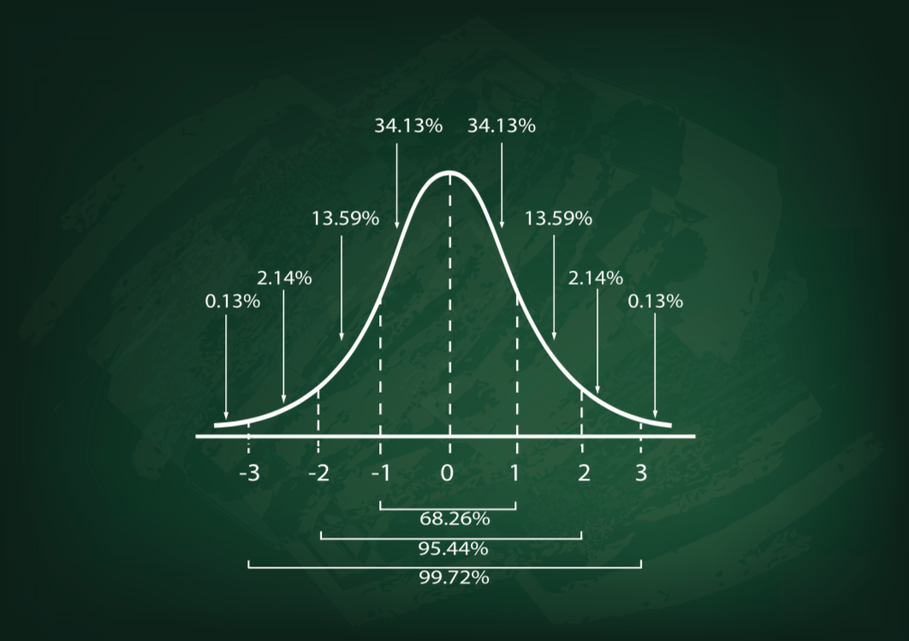

# 5.统计思维

统计学会很难，这四讲能带你搞懂日常生活中需要了解的统计学。

## 22 ｜用统计思维应对四阶风险

从这一讲开始，我给你讲统计思维。

对普通人来说统计学很难，其实不光统计，微积分、线性代数这些数学家眼中本来难度不值一提的东西，对普通人来说就是那么难。原因早就不是难在计算本身，而是难在普通人看着数据就发蒙。数据对普通人来说太不直观，不知道有什么用，怎么用。

统计思维与加减乘除一样，生活中每天都用得到。只是普通人不知道怎么用，于是以为用不到，永远无法完成将统计学课本上所学跟日常运用对接，反过来死死拦住了对统计学的硬学习。结果就是统计这东西永远都不可能懂，考前死记硬背，考完忘记，从此与它一别两宽，各自珍重。

太可惜了。

统计思维是那种既可以学，又必须学以致用的东西。一方面，它确实很有用；另一方面，必须用起来你才能真正理解它。

讲统计思维，我本来很犹豫。我出身文科，按做习题的硬实力，排在我前面的理科生还不是有千千万？不过反过来想，正因为我是文科生，而且我不是在学校里，而是在现实中懂得统计思维的重要性，回过头重学统计课，再将所学内化成人生指南的工具之一。这个过程对大多数人有用。

数学家跟你讲统计学，讲得完全正确，但你听完可能还是不懂。我跟你讲统计思维，肯定没有数学家那么精确，但相信你能听懂，因为我打通这条思维通道的路，跟你比较贴近。

我这就开始了。

养成统计思维之路，不是从刷教材开始，而是应该从面对风险开始。

每个人从睁开眼面对这个世界，就面对着无穷无尽各式各样的风险。它是我们时时都得面对、必须要有系统化方法来对付的东西。而统计思维就是我们工具箱里，最主要的系统化工具。统计思维对你我来说之所以有用，最主要就是它能帮助我们建立可用的模型，度量风险，合理决策。

### 一阶风险

所以，统计思维的第一讲，我们从理解风险开始。

什么是风险？

巴菲特说，风险就是投资损失的可能性。你把“投资”两个字，替换成你投入到任何事情里的任何成本，就变成了人们对风险的日常生活定义：发生损失的可能性。

考试有风险，填志愿有风险，找工作有风险，找对象有风险，生娃有风险，小升初有风险，开车有风险，照 X 光有风险，等等等等。人们在朴素意义上使用风险这两个字，而人生就是驾驭这些风险的旅程。

这种层次的风险，我叫作一阶风险（risk 1），它是风险金字塔的基础。细细分解，它有三个模块：

- 你暴露在风险中的可能性；
- 你暴露在风险中从而被伤害的可能性；
- 你如果受到伤害的话其程度有多大。

举个例子，如果我出行只坐飞机，那么汽车交通事故的风险就对我没有影响，有影响的只是飞机失事的风险，这是乘坐飞机暴露在风险中的可能性。一旦飞机失事，也就是暴露在风险中以后，受伤害的可能性比较高，受伤害程度也比较大，损失必然严重。好在失事概率极低，统算下来，各种统计公认，坐飞机出行比坐汽车出行更安全。我以前有个同事，坐飞机必定吓得面如土色，其实没有必要，他只看到风险事件发生后的严重程度，没看到其发生概率。

分析对你来说的具体风险的方向及其大小，三个模块缺一不可。

《黑天鹅》作者塔勒布讲过类似道理。他做交易员的时候，在公司晨会上预测当天市场多半会跌，但他还是要买入。同事们不理解。他说，虽然多半要跌，但跌幅有限，如果市场不跌反涨的话，涨幅会比较大。统算下来，买入的预期收益是正的。

这是一阶风险，但风险并不停留在一阶，因为人是智慧的动物，总会想办法对付风险。有些时候就直接化解掉，哪怕不能直接化解，绝大多数时候总能给风险事件定价。

君子不立危墙之下。危墙是风险事件，你可以选择不站在下面，规避风险。但是，如果必须有人站在危墙下面，这件事情并不是做不到的。重赏之下必有勇夫。钱给够了，定有人走过去站在那里。只要是能够定价的风险，价格就为风险作出了对冲。这世界上能有多少风险是人无法为之定价的呢？

### 二阶风险

当一阶风险能定价的时候，就落入了我们的预料之中，而但凡落入我们预料之中的风险，被对冲后就在一阶的意义上消失了。但是，风险不会彻底消失，它会在二阶归来。

所谓二阶风险（risk 2），指那些偏离我们预期、意料、计算之外的风险。凡是符合预期的一阶风险，我们都能采取行动，给出价格，把它给对冲掉。但偏离预期、出乎意料、没算到的那些风险，所谓二阶风险，我们怎么办？

比如说，世界卫生组织统计，近年来，全世界汽车交通事故平均每年造成 125 万人死亡。平均每年 125 万人死亡这个平均值，就是我们的预期和意料，这是一阶风险。保险公司可以计算出保费，开出保单，为人们提供对冲风险的工具。但是，具体到每一年汽车事故造成多少人死亡，这个数字肯定是起起伏伏，有多有少。

有意思的是，我们的预期是基于平均值的，但现实中几乎没有什么数据会落在平均值上，绝大多数时候都会偏离。你按百年一遇的洪灾作准备，结果第二年就发生了千年一遇的洪灾，这种事天天都在发生。这世界上每天都在发生万年一遇的风险事件。

当我们完成为预期的定价，对冲掉一阶风险之后，剩下来这些与预期的差距，用数字来表达成与均值之间的距离，就是我所说的二阶风险。

经受过一阶风险的洗礼后，二阶风险照样能干掉你。马克•吐温说，那些干掉我们的，不是我们不知道的东西，而是我们自以为知道的东西。

### 三阶与四阶风险

二阶风险之外，我们将面对三阶风险（risk 3），就是那些我们对其知道得更少，只知道其存在，但一不知道其平均值，二不知道其个体数据偏离均值程度，因此无法形成预期的风险，术语一般称之为不确定性（uncertainty），之所以我称之为三阶风险，是因为二阶风险虽然是意料之外，好歹你还有个意料。三阶风险则是你只知道不妙，但你连该意料什么都不知道。

比如说，对外星人明天会不会造访地球这个问题，你作何意料？你知道它不违反逻辑学，所以是可能的，但它事实上从未发生过，这世界上也不存在跟外星人接触过的地球人，此前也没有跟外星人交换过任何信息。我们没法意料，不能形成预期。

三阶风险已经够难对付的了，但在它之外还有四阶风险（risk 4），就是那些我们对其真正、彻底、完全一无所知的风险：没有预期，更不知道偏离预期的程度和范围，甚至根本没有想过其存在。顾名思义我无法举出一个对人成立的例子——但凡我能想出来的就已经不是四阶风险了。就打个比方吧：对恐龙来说，陨石撞地球就是属于它的四阶风险。

### 本讲小结

面对这四个层次的风险，统计思维能帮到我们的各有不同。

对一阶风险，统计思维让我们总是先去寻找基础概率（base rate），随时作数字管理，精细化我们的思维颗粒。

对二阶风险，统计思维给我们提供了一套经典工具，但凡发生过多次形成频率的，就有套统计学方法来处理它，在已知与未知之间搭一座天梯。

对三阶风险，统计思维给我们提供的是贝叶斯推断，哪怕是要渡过完全陌生的河流，也能为你摸着石头过河提供指引。

对四阶风险，那些我们连其存在都一无所知的风险，统计思维用处有限，任何思维在此时都用处有限。没有什么工具能帮我们作针对性准备，就像没有什么能帮助恐龙，事前对付它并不知道的天降陨石一样。

**对完全未知的风险，我们能用来面对它的，只有多元化生存，尽可能造成不被一击致命的局面，充分地展开自己选择的生活，并在最后一刻到来的时候，坦然接受命运。**

### 思考题

往往能看到人们把干涸了很久的河道利用起来，有的是种庄稼，有的是建房子，哪种合理？哪种不合理？为什么？

## 23 ｜一阶风险：找准你的位置

上一讲，我把风险分成四阶，一阶风险是对可能损失的预期，二阶风险指的是对预期的偏离，三阶风险是那些我们无法形成预期的风险，四阶是我们连其存在都不知道的风险。我会一阶一阶细讲。

这一讲，先讲统计思维怎样帮助我们处理一阶风险。

一阶风险就是我们日常理解的那种风险。告诉我会死在哪里，我就不去那里；投资时人太多的地方不要去；看不清楚搞不明白的时候，要先跑掉再思考；等等等等。

我们的语言库里留下了无穷无尽关于风险的格言，是无数鲜血凝结而成的教训。每个人关于风险都有朴素的认知。

### 从给风险定性到定量

但是，之所以说我们对风险的认知是朴素的，是因为即便对一阶风险的理解，我们都是远远不足的。我们发现风险的能力还可以，但度量风险的能力就很差。定性还凑合，定量基本不行。

大多数人在大多数时候的行为，就是在外部刺激下作本能反应，不思而应。心理学家、诺贝尔经济学奖得主卡尼曼称之为系统 1，速度快，几乎不动用大脑内存和运算资源。

相比之下，思而后应的时候非常之少。所谓思，在这里不是什么深邃思考，其实就是统计思维，收集和处理数据，根据概率决策。卡尼曼称之为系统 2。它慢，耗费大脑资源。我们不轻易用它。

不思而应与统计思维之间的区别，首先就是颗粒度不同。

在小朋友心智成长的关键阶段，看电影总会缠着大人问谁是好人谁是坏人。心智初开，只能分黑白、进退、对错、好坏、阴阳。“易有太极，是生两仪”，指的就是这阶段。大多数人在大多数事件面前，思维就永远停留在两仪这个颗粒度水平上：“告诉我谁是坏人，我打他！”

二分法本质上是个开关，本来有很强的演化合理性。在大草原上，羚羊要是看见树丛一动，它可没时间精细化思考树丛后有只猎豹的概率。它得马上逃跑，要不然就来不及。跑错了不过虚惊一场，不跑有可能死无葬身之地。演化给人埋下了同样的开关算法，关键时刻用来救命。

但开关算法太过粗糙，社会中越来越复杂的风险事件，它处理不了。太极生两仪，还得再往下走，两仪生四象，四象生八卦，八卦再组六十四卦。停下来，算一算，一件事的吉凶能分出 64 种层次。要是不停下来算，那你一辈子就是个开关。

《易经》颗粒度很精细了，但它还有个问题，它其实是 64 种定性分析，还不是定量分析。古人用来把握世界的模型没有统计思维的帮助，但今天我们有了，我们应该做到更好。

**第一，量化风险。**

量化首先就是给出数字。语言不精确，往往是各有各的理解。我曾经与父亲争执不休，他认为一百多这三个字指的是一百上下，我认为指的是一百多一点。谁也说服不了谁。

原来以为就是我们父子较劲，后来在《超预测》一书里看到，中央情报局也有类似的问题，他们曾经把预测强度分成四级：几乎不可能、有可能、很可能、基本确定。后来才发现，原来对每个情报分析师来说，这些词儿对应的概率区间都不一样，有人认为很可能是 80%可能，有人认为很可能是 60%可能。我才明白，原来大家都是稀里糊涂。

### 找默认值

**第二，凡事先找默认值。**

无论面对什么，要强制性地刻意地形成第一反应：这件事，这个风险的基准水平（base rate）是什么？

基准水平就是默认值，它是关于一件事一种风险己有的可靠统计数据。它是两层意义上的平均值：在人群中的平均值和在不同时间段之间的平均值。

举个例子，生病看医生，医生让你拍 X 光胸片或者 CT 胸片。你拍片还是不拍片？拍的话，拍哪种片？

绝大多数人都在定性的意义上知道，射线扫瞄对身体有害，但不能为有害的程度定量。相当多的人在定性的意义上知道 CT 扫瞄对身体的伤害比 X 光大，但具体大多少也无法定量。如果你要把医疗决策拿在自己的手中，你得知道下面这些基准数据：

每次 X 光胸片给身体造成 3.7 个毫拉德（MRADs）的辐射量，每次 CT 胸片造成 780 个毫拉德的辐射量。毫拉德是辐射计量单位，数值越高，人体所受辐射量越大，致癌率越高。

具体是多高呢？人体每受 100 个毫拉德的辐射，一生中得白血病的概率上升 1/10000000、肺癌的可能性上升 1/6000000、淋巴癌的概率上升 1/20000000。

这组数据是在各个时间段和各个人群中的平均值，它表达了医疗射线致病风险的基准水平，构成了我们在自己面临这类风险时的预期，是我们应该从之出发的默认值。决策时再加入自己的个体因素。

这里有两个要点：

第一，X 光、CT 的辐射风险平均而言很小，跟它提升诊断准确性的好处相比，承受这点风险几乎总是合算的；

第二，哪怕风险概率急剧上升时，你也不必马上就惊恐。CT 胸片的辐射量是 X 光胸片的 200 倍，其致癌风险大约也上升了 200 倍，但这并不意味着拍 CT 胸片很危险。极小概率风险显著上升后仍然很小，讲增长率不讲基数等于耍流氓。

根据风险的基准水平确定你对风险的预期，这个决策的质量取决于统计数据的质量。

我刚才讲的这些医疗检查辐射风险的数据来自手边一本英文书——Risk: A Practical Guide for Deciding What’s Really Safe and What’s Really Dangerous in the World Around You，两位作者 David Ropeik 和 George Gray 分别出身哈佛大学风险分析中心和哈佛大学公共健康学院，系统收集了美国人在日常生活里、常见环境中以及医疗决策时的，48 大类主要常见风险的基准数据。

人生在世并非事事不可知，有许多已经有可靠数据定量分析。越多数量的人越多重复的行为，其风险基准就越稳定；社会越稳定成熟，其搜集统计的风险基准数据就越完备，也越易被公众获得。美国是全世界的典范，中国在这方面很偏科：消费行为大数据全球领先，其他数据差距太大。

问你个问题，哪种意外事件最危险，造成最多死亡的事件？在书里翻到答案时，我是很意外的。

摔倒。

以美国为例，全体人口当中，因摔倒致死的比例是十万分之六，稳居所有事故死亡率之首，平均一年有一万多美国人死于摔倒，远超中毒、溺水、火灾、枪击。

摔死很惨，没摔死也很惨：每年平均每三个美国老人中就有一个摔伤。老人摔伤骨折难以恢复，往往从此不能摆脱轮椅和护理，生活空间和质量就此塌缩。

我之所以用美国数据，是因为我没有中国数据。目测在中国这些数据只高不低。没有风险基准数据的统计和发布，间接导致社会普遍忽视这一风险，进一步导致几无相应防范安排。请问你家中有无老人？洗手间有没有安装防滑倒装置？房间里有没有实现无障碍通行？家里尚且如此，公共场合更从何说起！

完备统计常见风险的基准数据，并让公众易于获得，这件事上中国的差距实在太大了。所以我推荐你找这本书来看，当作家庭风险百科全书备查，里面提到的大多数风险都可参照。凡事不决查一查，立竿见影改善决策质量。

### 不同取舍偏好

**第三，对风险的取舍是你自己的事。**

上一讲中讲到《黑天鹅》作者塔勒布的操作，虽然预期市场会跌，但还是要买入。因为预期跌幅有限，如果市场反过来不跌反涨，则预期涨幅较大，这样统算下来买入的预期收益是正的。他的逻辑就是要高度重视损益较大的小概率事件，特别是超大损益的超小概率事件。这也是《黑天鹅》这本书的精髓所在。

伯乐做法则与他相反。伯乐是中国历史上相马第一人。他收徒弟，不喜欢的徒弟就教他相千里马，喜欢的徒弟就教他相驽马，就是普通马。为什么呢？因为千里马不常有，专相千里马的一年也上不了一次工，相驽马的就天天有活干。跟塔勒布相比，伯乐更重视把握大概率事件，哪怕单次收益小。

高损益小概率事件和低损益大概率事件，你重视哪一个？你的气质偏塔勒布还是偏伯乐？其实都可以。他们都是统计思维大师，你跟随哪条道路都可以。记住风险既不是概率也不是后果而是其乘积，你的选择就谈不上犯错，只是气质的取舍。

要形成对风险基准的合理态度，最难的还是承认自己绝大多数时候并不特殊。

大多数人在大多数事情上，都默认自己在平均水平以上。这认知偏差之所以会发生，是因为这世界上没有一个人是平均的。而每个人对自己的特殊性过于熟悉，所以对自认高于平均总有自认很合理的解释，同时每个人对他人的特殊性既陌生也不关心。结果是不懂得在大多数事情上，大多数人的特殊性相互抵消。

换句话说，重视风险基准水平，是外部思维，从整体看；困于自己的特殊性，则是内部思维，只看到自己的那点千千结。

摆脱内部思维对所有人都很难，可惜只有天才和幸运儿才无须摆脱内部思维，绝大多数人必须强制性地压抑内部思维，要将基准水平当作决策起点，而不要把自己的特殊性当起点。

### 本讲小结

这一讲，我给你讲了面对一阶风险时如何利用统计思维决策：

第一，要精细化思维的颗粒度，形成对风险的量化预期。

第二，风险预期的默认值是基准水平，也就是靠谱的统计数据，它是人群中的平均值和跨时间段的平均值。

第三，节制内部思维，不要困于自己的特殊性；要刻意启用外部思维：除非有足够相反证据，要求自己在大多数事情上从基准出发作判断。

### 思考题

塔勒布关注高损益小概率事件，伯乐看重低损益大概率事件，你重视哪一个呢？

## 24 ｜二阶风险：以已知推断未知

上一讲，我们讲了一阶风险，也就是可能的损失。这一讲，我们讲二阶风险。它与一阶风险的差别是这样的：一阶风险是已知风险的预期值，二阶风险则是对预期的偏离，所谓预期差。用普通话来讲，一阶风险是意料，二阶风险是意外。

人是预期的动物，从过去搜集数据，在现在思考，向着未来行动。但凡风险在意料之中，就能采取行动，消化风险。但意料之外怎么办？

上一讲说到，美国平均每年有十万分之六的人死于摔倒，但每年死于摔倒的比例肯定都不一样，有的年份会高，有的年份会低。保险公司如果只按十万分之六来给意外险定价的话，遇到事故发生特别多的年份，就亏死了。长期中这个比例会回到均值，但要是短期中保险公司绷得太紧没留出余地，在短期中就挺不住倒掉了，那长期对它没有用处。对冲了意料之中，还要给意料之外留出余地。

### 正态分布

怎样衡量这个余地？

偏离预期的程度小风险就小，偏离预期的程度大风险就大。统计学提供了一把能够测量偏离程度的尺子，帮你度量风险，它叫标准差。

标准差度量数据偏离平均值的程度。

以上面讲的摔倒为例，它是这样得出来的：首先把每年美国人实际死于摔倒的比例，依次减去平均值；值可能为正可能为负，所以取平方再相加，再除以年数，就得到了方差，再开平方根得到标准差。标准差越大，这组数据偏离其均值的程度就越高，风险就越大，反之则越小。

如果你知道一组数据的均值和标准差，那么，哪怕不知道每个数值是什么，你已经驯服了其中蕴含的大部分风险，如果这组数据是正态分布的话，简直就是全部风险。

所谓正态分布，呈现为钟形曲线，左右对称，最高点是这组数据的平均值，向左右两侧放下伸展出尾部，好像一口钟。

在正态分布里，数据非常集中，绝大多数数据集中在平均值周围，极少部分分布在两侧尾部。具体来说，在距均值一个标准差的距离内，有 68.3%的数据，两个标准差之内有 95.4%，三个标准差之内就能涵盖 99.7%。得到钟形曲线，意味着二阶风险尽在掌握。

面对钟形曲线，你能精确地表达自己想要拥有多少风险。来一个标准差的？还是两个三个的？

你读论文看科普，最常见一个数字，5%，这不是偶然，它对应着约两个标准差。两个标准差以外的尾部是小概率事件，被认为不大会发生，管住 95%风险足够了。

如果是智商，则两个标准差之内对应着智商 70 到 130 的区间，其两侧分别是弱智和天才的门槛。普通人的智商则在一个标准差之内，85 到 115 之间，2/3 的人都在这里。

钟形曲线刻画风险，就是这般了如指掌。

### 中间层工具

当然，正态分布、钟形曲线，并不是这个世界的常态。正态分布要求随机可重复事件且彼此相互独立。世界上太多事情或者不随机，或者不可重复，或者并不相互独立。

比如收入就不是正态分布，它既不随机也不独立，因此收入分布的形状不是钟形曲线，更像是金字塔结构，所谓二八法则，20%的人拥有 80%的财富，层层往上。

之所以说世界是未知的，从统计思维的角度看，就是因为把世界当作总体，它的数据怎样分布对我们是未知的。黑夜里走路，手电筒照亮眼前一小段路，但灯光之外的黑暗里有多少坎多少沟多少洞，看不见。

所幸统计学有大数定律和中心极限定理这些工具，在看得见与看不见之间，给我们搭了一座天梯。不管总体是怎样分布的，只要抽样过程满足随机、独立性要求，样本量足够，那就有两个关键结果：

- 第一，根据中心极限定理，样本的均值是正态分布。
- 第二，根据大数定律，样本均值的均值约等于总体均值。

也就是说，统计学能构造出一个我们恰好会处理的正态分布，并根据它的性质来对总体作出推断。

总体均值，样本均值，样本均值的均值，三个层次的概念很绕，我来举个例子。

比如说你想知道北京市所有人的平均收入。前面说了，收入不是正态分布，另外北京有 2000 万常住人口，你也不可能去穷尽每个人的收入信息。那你怎么才能知道平均收入？

如果你多次随机抽样，每次相互独立，样本容量足够大——比如每次抽 400 人，总共抽样 1000 次——那么：

- 第一，我们想知道的是北京市人口的平均收入，这里叫作总体均值。
- 第二，通过 1000 次抽样，产生 1000 个样本，每个样本中的 400 人有个平均值，叫作样本均值，1000 个样本均值之间还有个平均值，叫作样本均值的均值。
- 第三，样本均值的均值约等于总体均值，所以，只要获得这些样本均值，再取其平均值，我们就得到了北京市人口的平均收入。

抽样 1000 次只是我为了方便解释，现实中没有人这么麻烦，抽样调查毕竟是有成本的。现实中往往只抽一次，一次就够用。

为什么？

复习一下：中心极限定理告诉我们，样本均值是正态分布。大数定律告诉我们，样本均值的均值，约等于总体平均值。

现在，只抽一次样，只产生一个样本均值数据，要用它去推断北京市总人口平均收入，等于要回答这个问题：在那个样本均值的正态分布里，如果只知道其中一个样本的均值数据，那么，它与样本均值的均值，也就是总体均值，也就是北京市平均收入的距离是多少？

回答这个问题，只需要再知道一样东西：样本均值的标准差。

我们并不知道样本均值的标准差，惟一知道的是这一次抽样 400 个人收入的样本标准差。统计学的处理方法是，用样本标准差除以标本容量的平方根，来推算样本均值的标准差。这法子不完美，但没有更好的办法。统计思维有什么就用什么，并不因为不完美就停在那里不往前走。

好了，现在推断北京市平均收入的条件都已具备：

- 第一，你只要判断样本均值的均值就可以了，因为它等于总体均值。
- 第二，根据样本标准差，推算样本均值的标准差。抽样得到的单个样本均值，距样本均值的均值的距离，等于样本均值的均值距样本均值的距离——你跟我的距离，等于我跟你的距离。
- 第三，用样本均值的标准差，来衡量样本均值与样本均值的均值的距离。

在这个例子里，你抽样已经得到了样本均值，样本均值的标准差已推算，至于距离样本均值的均值，也就是北京市平均收入几个标准差，就看你的要求了。如果你要求估计得宽一点，标准差个数就多一点；估计得窄一点，标准差个数就少一点。

假如抽样 400 人得到的均值是年收入 8 万元，标准差是 2 万元，那么，推算样本均值的标准差是 2 万/400 开平方根等于 1000。那么，我就有 95%的把握，北京人的平均收入在 7.8 万到 8.2 万之间，它对应着两个标准差；有 99.7%的把握，北京人的平均收入在 7.7 万到 8.3 万之间，它对应着三个标准差。估计得越宽，我的把握就越大，反之亦然。

上面这个操作，统计学叫作置信区间。你日常看见的许多统计数据都是区间估计，人均收入是，美国总统大选预测也是。它表面上是一个数据，实际上总是伴随着一个区间，还有一个与区间对应的置信水平，就是有把握程度。

到这里，入门统计学的核心就都有了。在已知与未知之间，统计学就这样给我们搭了一座天梯，剩下的就是把正态分布、钟形曲线掰开揉碎的各种应用：

- 如果已知均值和标准差，你就知道任何一个数据在分布中的位置。这操作叫点估计。
- 如果已知样本均值和标准差，去估计未知的总体均值，这操作叫置信区间。
- 如果已知总体均值，想检验一个新假设，于是用抽样获得样本均值，再考察样本均值出现的概率是否落在给定显著性水平之内，由此决定是否接受这个假设，这操作叫作假设检验。

如果已知你面对的是个正态分布，事情很简单；如果你不知道面对的是什么分布，那么，在未知的总体与你已知的抽样之间，统计学用大数定律和中心极限定理戏法，构造出一个正态分布的中间层，再根据你预定的精度要求，用抽样数据透过中间层去推断未知。

**点估计、置信区间、假设检验，这些令普通人头昏脑涨的操作，本质都是同一套操作，差别只在于总体均值、样本均值、精度要求当中，你给定哪一个，求解哪一个。**

### 本讲小结

我最后再讲几个提醒。

第一，统计学的核心不是梳理已知，绝大多数时候不是列举全部数据，那是大数据的活。统计学是小数据，核心是用已知推断未知。

第二，统计学依靠数学但不是数学，它尽可能严格但没法严格到底，在没理想工具的时候，它是有什么用什么，在我们预定的精度水平上，去推断未知。看跟统计有关的任何结论，一定不要只看单一结论，还要看区间多大，预定的精度是多少。

第三，未知地带总是有意外等着我们。以股价为例，现代金融学早期将股价波动近似地当作正态分布来处理，但正态分布过低估计了小概率重大事件出现的频率。

1987 年华尔街黑色星期一，道指下跌 27%，按正态分布算出来的概率小到整个宇宙诞生以来的时间都不够这事发生。股票指数的涨跌不是正态分布现在已成常识，那它到底是什么分布？用什么工具去处理它？金融界今天还在打补丁。

所有模型都是错的，好在有些还有用，能用将就用，不能用的将就修修接着用。

### 思考题

通用电气公司（GE）曾经实行过著名的 6 个西格玛管理，西格玛就是标准差，6 个西格玛指正确率要达到 6 个标准差的水平。请问具体是个什么水平？我提示一下，是个有点变态的水平。

## 25 ｜三阶风险：一切皆可博

上一讲，说了怎么应对二阶风险，是用已知的抽样，在统计学的支持下构造出一个正态分布，再以正态分布的性质为桥梁，去推测未知的分布。

这是入门统计学的标准操作，叫作频率主义：之所以它能以所知知所不知，是以频率为前提：事情必须重复发生，才谈得上去作推断。

用频率主义，帮助你面对风险作判断决策，有两个问题，一个是小问题，一个是大问题。

小问题是大脑不是计算器，不能随时随地去计算均值、标准差、置信区间、显著水平。不做运筹管理、学术研究的话，你很少会用到这套统计学操作。

大问题是你面对的许多事情不怎么重复，而且越重要的事情越是不可重复，最重要的事情往往是一次性事件。频率派面对这种事情摊开手：一次性事情没有概率可言。

那怎么办？弃疗吗？

### 贝叶斯推断

还好，统计思维还有另一套工具，贝叶斯推断。

频率主义是客观的，其基础是一件事发生的频率；贝叶斯推断则是主观的，基础是你对一件事发生的信心。客观的好处是客观，坏处是没有就是没有。主观的坏处是主观，好处是可以无中生有。它拥抱先入之见，敞开接受各种性质的信息，不限于频次。

做个抛硬币的游戏。拿出一枚硬币抛两次，请问两次都是正面朝上的概率是多少？

是 1/4 吗？

正常硬币一次正面朝上的概率是 1/2，两次就是 1/4。最基础的概率知识告诉你两次正面朝上的期望值就是 1/4。

但是，假设你对硬币一无所知，并不知道硬币有没有做过手脚，做过手脚的话搞不好总是正面朝上，或者总是正面朝下。你会说，瞎猜还有完吗？如果硬币做过手脚，天知道两次正面都朝上的概率是多少？

贝叶斯人就敢来试试。他说，两次正面朝上的概率是 1/3。

他这么算，掷两次硬币，总共有三种结果，一种是两次正面朝上，一种是一次，一种是一次都没有。那么，两次正面朝上的概率就是 1/3。

你很难接受是吧？这里的重要前提是你对硬币做没做手脚一无所知。频率主义者认为没做手脚的话概率是 1/4，做过手脚的话则不可知。在反复掷硬币之前什么都不知道。

但你是个人，总不能被无知困在原地，总要制定个计划，找个立足之地，找条走出去的路。这时你就用得上贝叶斯主义。贝叶斯人觉得，正是因为你什么都不知道，所以不妨从 1/3 这个起点出发，每掷一次调整一下看法，掷的次数足够多，你就知道它靠不靠谱了。

贝叶斯推断我在前两期认知训练营里都有过介绍，主要是在 2018 年的课程《怎样训练贝叶斯脑》，建议你听那一讲。在那篇文章里，我介绍了一种简单的贝叶斯推断方法。凡事不决，掰下花瓣。她爱我，左边放一瓣；她不爱我，右边放一瓣，最后算算两边花瓣的比例，你便得到了这宗单相思的期望值。

花瓣推断法来自于法国数学家拉普拉斯。他假设，如果我们面对问题，一无所知，那么，列出所有可能，分配以相同权重，以此作起点。然后，新的经验带来信息，相应调整权重，花瓣渐渐成堆，你的看法就成形了。

当然，绝大多数时候，我们不是从零开始形成看法，而是从老看法更新到新看法。贝叶斯推断告诉我们该怎样做这个更新。

关于这个世界上的任何问题，你都可能有一个看法，或者叫作理论，或者叫作设想，我们谦虚一点，统一叫作假说。假说对不对呢？说到底要看证据。

有了这个假说之后，或者你目睹了一件事，听到了一个信息，或者哪怕你做了一个梦，没关系，我们把这些都叫作证据。贝叶斯推断告诉你，在新的证据面前，我们如何刷新对已有假说的信心。

公式：

P(假说|证据) = P(证据|假说) \* P(假说) / [P(证据|假说) \* P(假说) + P(证据|其他原因) \* P(其他原因)]

这个公式是在说，新证据怎样刷新我们对假说的信心，取决于新证据之所以出现是因为假设成立呢，还是因为其他原因使它出现。假设成立这种原因占所有可能原因的比例，就是我们在获得新证据后对假说形成的新的信心。

比如，一宗凶案发生了，福尔摩斯发现，作案时间里，平常见人就叫的猎犬没有叫。福尔摩斯认定是熟人作案。套用贝叶斯推断，熟人做案所以猎犬不叫的可能性，在猎犬不叫的所有可能组合当中，占到多大比例？

福尔摩斯说，排除掉所有原因后，那个再不可能的原因也是原因。在情感上再不愿意接受熟人就是凶手这个现实，也得在理智上承认，如果猎犬见到陌生人一定会叫，那么凶手只能是熟人。福尔摩斯断案如神，靠的就是将贝叶斯推断进行到底。

### 赔率思维

实事求是地说，上面那个贝叶斯定理的标准公式还是会让绝大多数人头晕。证据在多大程度上证实了假说，要看证据之所以出现在多大程度上是因为假说成立。太绕。

好在，如果是在两个互斥的假说之间作取舍的话，贝叶斯推理有个绝对清楚简易的表达，把它变成一次打赌。这也是为什么一个真正的贝叶斯人必须随时准备为自己的判断下注。

具体是下面这个公式：

新赔率(posterior odds) = 似然比(likelihood ratio) \* 旧赔率 (prior odds)

我解释一下这三个概念。

什么是赔率？你买足彩的话应该很熟悉。假如皇马对巴塞你买皇马，赔率一赔一，意思就是你下一块钱的注，输了归零，赢了拿回两块钱。赔率与概率有个对应关系，一赔一意味着双方机会均等，你认为皇马有 50%的概率赢。旧赔率指你原来对皇马有多大概率赢的判断，新赔率指新信息进来后，你形成的新判断。

假设你发现一个惊天秘密，皇马教练买了巴塞赢球。怎样用这个发现来更新你的赔率？

关键就是似然比。似然比=如果皇马会赢球，皇马教练买巴塞的可能性/如果皇马会输球，皇马教练买巴塞的可能性。

肯定是微乎其微。似然比，比的就是两个相反假设各自导出同一个结果的可能性大小。这个例子里，皇马教练掌握绝对的内幕信息，又没有人会主动去做赔钱买卖，那么，这里的似然比估计个 1%是很客气的了。

套进上面的式子：

- 似然比=1%
- 旧赔率=1
- 新赔率=1\*1%=1%

也就是说，原来是一赔一，当你得知皇马教练买了巴塞之后，应当更新成一赔一百。你得马上去买巴塞，一直到官方赔率跟上来之前，你都是赚的。

但凡是这种在两个互斥假说之间作取舍的情景，用赔率来表达与用条件概率来表达，两者是完全等价的。具体的计算我写在附录里，你可以到文末去查。

赔率算法的优势是更简单，确定自己愿意为原来的看法如何下注，乘以新信息带来的似然比，你就知道自己应该把下注调整到多少了。

一个表里如一的贝叶斯人随时准备下注，因为他的世界观是用赔率构建的。看什么都是赔率，表达看法就是下注，下注就是表达看法。知行合一，莫过于此。

如果你想像一个贝叶斯人那样来对待风险，要记住几点：

第一，你得准备好永远地告别确定性。贝叶斯人的世界里没有 1 和 0。如果一件事绝对会发生，或者绝对不会发生，那么你连赔率都开不出来。

第二，你得随时更新自己的看法，如果新的证据足够强，你要弃昨日之你如弊履。

第三，你也要意识到，证据未必会将起点不同的贝叶斯人带到同一个地方。这是我近来认知更新之处。

我曾经以为，不论起点差别多么大，只要诚实地根据证据持续刷新看法，贝叶斯人的看法总会趋同。现在我确定并非如此。假设有三个人，第一个人认为上帝是仁慈的，第二个人认为上帝是残暴的，第三个人认为上帝对人是冷漠的。这三位面对同一件事，都能用这件事来强化自己已有的看法。

坐井观天，拥抱先入之见，使贝叶斯人在面对任何陌生风险时，都不会僵住不知所措，这是保佑，也是诅咒。

### 四阶风险

统计思维课到目前为止，我讲了三种风险，一种是有预期的风险，一阶风险；一种是偏离预期的风险，二阶风险；一种是我们对它主观形成个预期，先用起来然后再调整，这是三阶风险。

对不同风险我们要形成不同的肌肉反应。对一阶风险我们要条件反射地去查找其基础概率，对二阶风险我们首先要找出标准差，对三阶风险我们首先要确定新信息对老看法的似然比。

现在我要讲的是四阶风险，就是我们不仅对它是什么一无所知，甚至对它的存在本身也一无所知的风险。

我无法举出哪怕一个四阶风险的例子，因为只要我举得出，它就从四阶降到了三阶。我只能类比地举个例子，对恐龙来说，陨石撞地球就是四阶风险，恐龙对能灭绝它的风险一无所知。

那么，四阶风险你怎么对付？

第一个办法：使自己总是处于不被一击致命的状态，因为你不知道会杀死你的风险来自何方，所以只能在各个方向都有所准备。它叫作多元化。

多元化不一定能确保躲过风险，但它能保证你比那些不多元化的人，有更好的机会免于被风险一击即垮。

第二个办法：做现在看起来没必要做的灾难准备。

灾难准备要有用，几乎总是要在看来没必要的时候做。等发现有必要的时候做准备已经太晚了。一是因为灾难的降临不是线性的而是加速的，越是来降临之前越快，来不及；二是因为到那时跑道太拥挤，你跑不过的。

第三个办法：珍惜当下，享受现在。这是斯多葛人的选择。洞察一切美好终将如泡影消逝，但享受美好，让当下过得有价值。

面对风险，统计思维能帮我们的都帮到了，剩下的得靠我们自己。

### 思考题

外星人造访地球是几阶风险？你认为未来 1000 年内外星人造访地球的可能性有多少？你用一下自己望天打卦的本事，估一估。

### 附录

但凡在两个互斥假说之间作取舍，用赔率来表达与用条件概率来表达，两者是完全等价的。

本来有两个假设 H1、H2，现在出现了新信息 E，按照条件概率公式，应该这样刷新 H1 和 H2 的概率：

P(H1|E) = P(H1) \* P(E|H1) / P(E) ..........(1)

P(H2|E) = P(H2) \* P(E|H2) / P(E) ..........(2)

其中，

P(H1)、P(H2)是先验概率，P(H1|E）、P(H2|E）是后验概率。先验概率之比 P(H1) / P(H2) 是原赔率，后验概率之比 P(H1|E) / P(H2|E) 是新赔率。

P(E|H1)是新信息 E 出现后 H1 的似然率（likelihood），P(E|H2)是 H2 的似然率，两者之比即似然比(likelihood ration)。

将(1)除以(2)，可得：

P(H1|E) / P(H2|E) = P(H1) / P(H2) \* P(E|H1) / P(E|H2)

也即：新赔率=原赔率\*似然比
